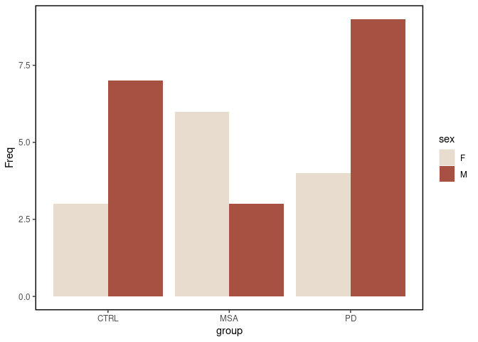
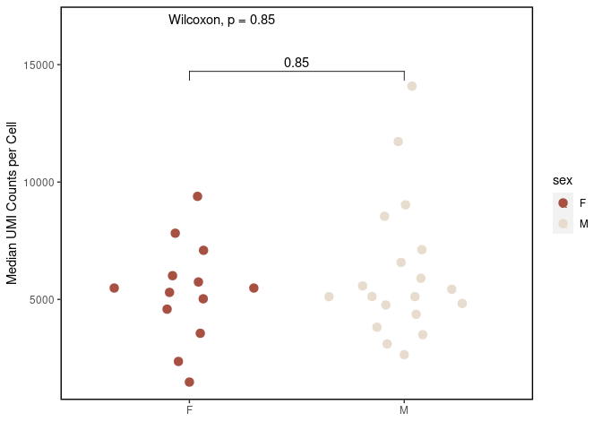
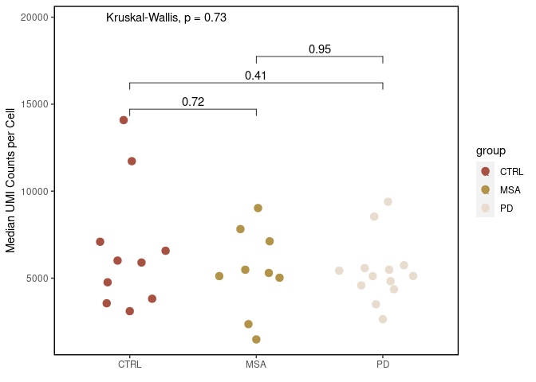
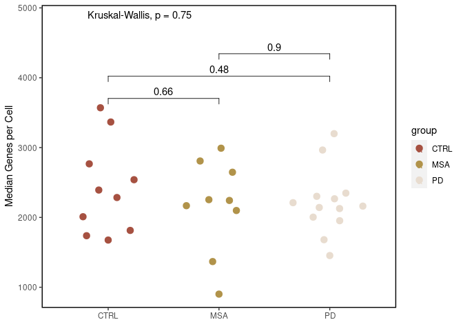
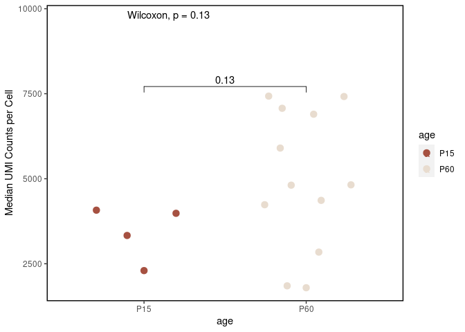

R Notebook
================

# CRMetrics class

## Initializing a CRMetrics class

Source the file in which the class is defined.

``` r
source("create_R6_class.R")
```

    ## ── Attaching packages ─────────────────────────────────────── tidyverse 1.3.1 ──

    ## ✔ ggplot2 3.3.5     ✔ purrr   0.3.4
    ## ✔ tibble  3.1.6     ✔ dplyr   1.0.9
    ## ✔ tidyr   1.2.0     ✔ stringr 1.4.0
    ## ✔ readr   2.1.2     ✔ forcats 0.5.1

    ## ── Conflicts ────────────────────────────────────────── tidyverse_conflicts() ──
    ## ✖ dplyr::filter() masks stats::filter()
    ## ✖ dplyr::lag()    masks stats::lag()

Initialize a new object of class `CRMetrics` with the path to the Cell
Ranger output and a metadata file. The metadata file contains a column
`sample` with the samples and optionally more columns with factors.

``` r
crmetrics <- CRMetrics$new(data_path = "/data/PD-MSA_lentiform_nucleus/counts_premrna/", 
                           metadata_file = "../data/metadata.csv")
```

    ## Warning in read_summary_metrics(data_path, self$metadata): excluded failed
    ## sample PD_7787_FAIL

We populated the metadata and the summary metrics field of the object
when initializing it.

``` r
head(crmetrics$metadata)
```

    ##       sample group sex
    ## 1   CTRL_037  CTRL   M
    ## 2   CTRL_039  CTRL   F
    ## 3 CTRL_09051  CTRL   M
    ## 4 CTRL_09055  CTRL   F
    ## 5 CTRL_09057  CTRL   M
    ## 6 CTRL_09148  CTRL   M

``` r
head(crmetrics$summary_metrics)
```

    ## # A tibble: 6 × 3
    ##   sample   metric                            value
    ##   <chr>    <chr>                             <dbl>
    ## 1 CTRL_037 Estimated Number of Cells      7370    
    ## 2 CTRL_037 Mean Reads per Cell           51730    
    ## 3 CTRL_037 Median Genes per Cell          2285    
    ## 4 CTRL_037 Number of Reads           381254619    
    ## 5 CTRL_037 Valid Barcodes                    0.968
    ## 6 CTRL_037 Sequencing Saturation             0.673

## Plotting

From the metadata file we can plot the number of samples per group where
we can also compare the sex distribution.

``` r
crmetrics$plot_samples(comp_group = "sex")
```

    ## Note: Using an external vector in selections is ambiguous.
    ## ℹ Use `all_of(comp_group)` instead of `comp_group` to silence this message.
    ## ℹ See <https://tidyselect.r-lib.org/reference/faq-external-vector.html>.
    ## This message is displayed once per session.

<!-- -->

Now we can already create plots from the summary statistics. E.g.,
`Median UMI Counts per Cell` is defined in the Cell Ranger summary
statistics of each sample.

The comparison group is a column in the metadata file. It will be the
variable on the x-axis and pairwise statistical comparisons will be made
on these groups.

``` r
crmetrics$plot_median_umi(comp_group = "sex")
```

<!-- -->

``` r
crmetrics$plot_median_umi(comp_group = "group")
```

<!-- -->

If no comparison group is specified, the samples are plotted on the
x-axis.  
This is potentially not very meaningful but it ensures that the plots
work even if we don’t have groups in the samples.

``` r
crmetrics$plot_median_umi()
```

    ## Warning in f(...): The default behavior of beeswarm has changed in version
    ## 0.6.0. In versions <0.6.0, this plot would have been dodged on the y-axis. In
    ## versions >=0.6.0, grouponX=FALSE must be explicitly set to group on y-axis.
    ## Please set grouponX=TRUE/FALSE to avoid this warning and ensure proper axis
    ## choice.

<!-- -->

Specifying comparison that is not a column in the metadata will throw an
error.

``` r
crmetrics$add_comparison("gropu")
```

    ## Error in crmetrics$add_comparison("gropu"): comp_group %in% colnames(self$metadata) is not TRUE

We can add a comparison group globally which will be the default if not
specified in the plotting function

``` r
crmetrics$add_comparison("group")
crmetrics$plot_median_umi()
```

<!-- -->

A possibility to reset the comparison group is to se the field in the
class to `NULL`.

``` r
crmetrics$comp_group <- NULL
```

Another plot that can be made from the summary metrics is number of
cells.

``` r
crmetrics$plot_cells("group")
```

<!-- -->

We can also create plots on statistics of the count matrices.  
This requires to load the detailed metrics and will some time.

``` r
crmetrics$add_detailed_metrics()
```

    ## reading 32 dataset(s)

    ##  done

``` r
# this is slow so we can also cheat if we already have the file

# metadata <- read.csv("../data/metadata.csv")
# detailed_metrics <- read_detailed_metrics(samples = metadata$sample, data_path = "/data/PD-MSA_lentiform_nucleus/counts_premrna/")

# crmetrics$detailed_metrics <- detailed_metrics
```

We can plot the distribution of number of UMIs and expressed genes in
each sample.

``` r
crmetrics$plot_gene_count()
```

<!-- -->

``` r
crmetrics$plot_umi_count()
```

<!-- -->

And of course add group information.

``` r
crmetrics$plot_gene_count(comp_group = "group")
```

<!-- -->

## 15q

15q sample analyzed with Cell Ranger.

``` r
list.dirs("/data/15q/counts_premrna/", recursive = F, full.names = F)
```

    ##  [1] "AAM1_P15q15"  "AAM1_P60q15"  "AAM10_P15q15" "AAM10_P15wt"  "AAM11_15Qa"  
    ##  [6] "AAM11_15Qb"   "AAM11_wta"    "AAM11_wtb"    "AAM12_15qa"   "AAM12_15qb"  
    ## [11] "AAM12_wta"    "AAM12_wtb"    "AAM3_P15wt"   "AAM3_P60wt"   "AAM8_P60q15" 
    ## [16] "AAM8_P60wt"

We need to do the annotation of condition and age manually. All samples
where no age is specified in sample name are assigned to P60. We are
lacking sex information.

``` r
metadata_15q_cr <- c(
  c("AAM10_P15q15", "15q", "P15"),
  c("AAM10_P15wt", "wt", "P15"),
  c("AAM11_15Qa", "15q", "P60"),
  c("AAM11_15Qb", "15q", "P60"),
  c("AAM11_wta", "wt", "P60"),
  c("AAM11_wtb", "wt", "P60"),
  c("AAM12_15qa", "15q", "P60"),
  c("AAM12_15qb", "15q", "P60"),
  c("AAM12_wta", "wt", "P60"),
  c("AAM12_wtb", "wt", "P60"),
  c("AAM1_P15q15", "15q", "P15"),
  c("AAM1_P60q15", "15q", "P60"),
  c("AAM3_P15wt", "wt", "P15"),
  c("AAM3_P60wt", "wt", "P60"),
  c("AAM8_P60q15", "15q", "P60"),
  c("AAM8_P60wt", "wt", "P60")
)
```

Format and save metadata as csv.

``` r
metadata_15q_cr <- data.frame(matrix(data = metadata_15q_cr, ncol = 3, byrow = TRUE))
colnames(metadata_15q_cr) <- c("sample", "condition", "age")
write.csv(metadata_15q_cr, "../data/metadata_15q_CRMetrics.csv", row.names = F)
```

``` r
crmetrics_15q <- CRMetrics$new(data_path = "/data/15q/counts_premrna/", 
                               metadata_file = "../data/metadata_15q_CRMetrics.csv")
```

``` r
crmetrics_15q$plot_median_umi(comp_group = "condition")
```

<!-- -->

``` r
crmetrics_15q$plot_median_umi(comp_group = "age")
```

<!-- -->

``` r
crmetrics_15q$add_detailed_metrics()
```

    ## reading 16 dataset(s)

    ##  done

``` r
crmetrics_15q$plot_gene_count(comp_group = "condition")
```

<!-- -->

``` r
crmetrics_15q$plot_umi_count(comp_group = "condition")
```

<!-- -->
