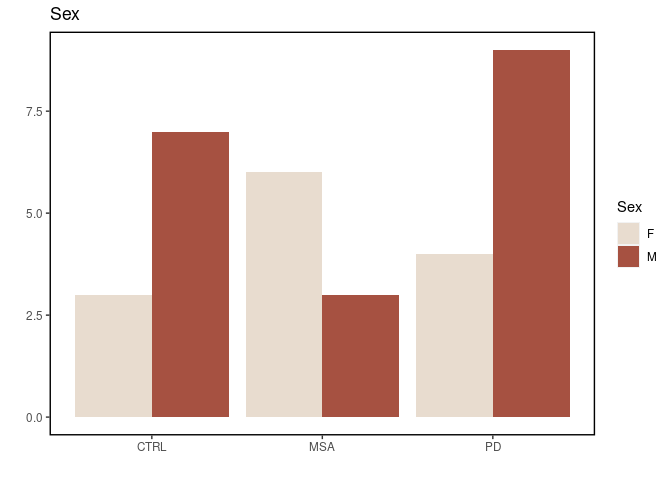
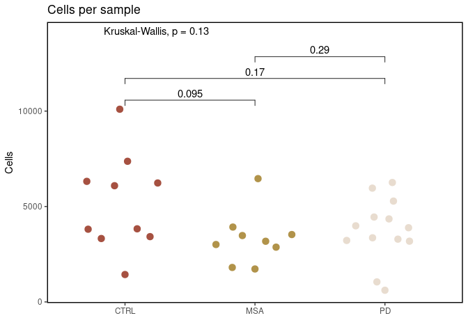

Inspiration for CRMetrics
================

## Setup

``` r
library(magrittr)
library(dplyr)
```

    ## 
    ## Attaching package: 'dplyr'

    ## The following objects are masked from 'package:stats':
    ## 
    ##     filter, lag

    ## The following objects are masked from 'package:base':
    ## 
    ##     intersect, setdiff, setequal, union

``` r
library(ggplot2)
library(ggbeeswarm)
source("http://pklab.med.harvard.edu/rasmus/scRNA_helper.R")
# devtools::install_github("EdwinTh/dutchmasters")
library(dutchmasters)
library(ggpubr)

## Mod
mod <- theme(panel.background = element_rect(fill = "white", colour = "black", size = 1, linetype = "solid"),
             panel.grid.major = element_blank(),
             panel.grid.minor = element_blank(),
             legend.position = "none")

## Comparisons
comp <- list(c("CTRL","MSA"),
             c("CTRL","PD"),
             c("MSA","PD"))

## Pallette
pal <- "pearl_earring"
```

This is just to show examples of plots. Here, I have three groups and
I’ve alreaded collected the metrics data in a separate file (manually)

``` r
dat <- read.table("/data/PD-MSA_lentiform_nucleus/rasmus/Sample summary.csv", sep=";", dec=".", header=T)[-31,]
```

## Plots

``` r
sex.plot <- table(dat$Group, dat$Sex) %>%
  data.frame %>% 
  setNames(c("Group","Sex","Freq")) %>%
  ggplot(aes(Group, Freq, fill=Sex)) + 
    geom_bar(stat="identity", position="dodge") + 
    mod + 
    labs(title="Sex", x="", y="") +
    theme(legend.position="right") +
    scale_fill_dutchmasters(palette = pal)

sex.plot
```

<!-- -->

``` r
# Needs statistics
```

``` r
cells.plot <- ggplot(dat, aes(Group, Cells, col=Group)) + 
  geom_quasirandom(size=3) + 
  mod + 
  labs(title="Cells per sample") + 
  xlab("") + 
  ylab("Cells") + 
  stat_compare_means(comparisons = comp, exact=F) +
  stat_compare_means(label.y = 14000) +
  scale_color_dutchmasters(palette = pal)

cells.plot
```

<!-- -->

``` r
cowplot::plot_grid(plotlist = list(
  sex.plot,
  cells.plot
), ncol=2)
```

<!-- -->

## Load count matrices

``` r
samples <- dir(path="/data/PD-MSA_lentiform_nucleus/counts_premrna/") %>%
  .[-grep("FAIL",.)]

cms <- samples %>% 
  lapply(function(x) {
    paste0("/data/PD-MSA_lentiform_nucleus/counts_premrna/",x,"/outs/filtered_feature_bc_matrix")
  }) %>%
  plapply(pagoda2::read.10x.matrices, n.cores = 6, progress = T)

# names = dir(path="counts_premrna/") %>% .[-grep("FAIL",.)]

# cms <- renameCols(cms, names)
```
