CRMetrics - Cell Ranger Filtering and Metrics Visualization
================

-   [Preparations](#preparations)
-   [Using Python modules](#using-python-modules)
-   [Initializing a CRMetrics class](#initializing-a-crmetrics-class)
-   [Remove ambient RNA](#remove-ambient-rna)
    -   [CellBender](#cellbender)
        -   [Installation](#installation)
        -   [Analysis](#analysis)
        -   [Plotting](#plotting)
    -   [SoupX](#soupx)
-   [Plot summary statistics](#plot-summary-statistics)
    -   [Samples per condition](#samples-per-condition)
    -   [Metrics per sample](#metrics-per-sample)
    -   [Metrics per condition](#metrics-per-condition)
    -   [Metrics per condition with &gt;2
        levels](#metrics-per-condition-with-2-levels)
    -   [Metrics per condition with numeric
        covariate](#metrics-per-condition-with-numeric-covariate)
-   [Add detailed metrics](#add-detailed-metrics)
-   [Embed cells using Conos](#embed-cells-using-conos)
-   [Cell depth](#cell-depth)
-   [Doublet detection](#doublet-detection)
    -   [Differences between methods](#differences-between-methods)
-   [Mitochondrial fraction](#mitochondrial-fraction)
-   [Plot filtered cells](#plot-filtered-cells)
-   [Filter count matrices](#filter-count-matrices)

# Preparations

We have selected a [publicly available
dataset](https://www.ncbi.nlm.nih.gov/geo/) from GEO with accession
number GSE179590 which can be downloaded
[here](http://kkh.bric.ku.dk/fabienne/crmetrics_testdata.tar.gz). You
can download the zipped data using wget or curl, e.g. 
`wget http://kkh.bric.ku.dk/fabienne/crmetrics_testdata.tar.gz`, and
then unpack using `tar -xvf crmetrics_testdata.tar.gz`

# Using Python modules

We have included several Python modules in this package. If you work on
a server using RStudio Server, there may be some preparational steps
needed for getting the doublet detection to work. If you are on your own
machine, it should be enough to install `reticulate` and the relevant
Python module(s).

First, you should install `reticulate`:

``` r
install.packages("reticulate")
library(reticulate)
```

Then you are ready to create a conda environment. In this example, we’re
on a server and we load `miniconda` using modules. The `conda` parameter
should point to wherever your conda binary is located (in terminal, try
`whereis conda`)

``` r
conda_create("r-reticulate", 
             conda = "/opt/software/miniconda/4.12.0/condabin/conda", 
             python_version = 3.8)
```

There is a known problem with openBLAS which may be different between R
and Python. If this is the case, you will receive the error
`floating point exception` and R will crash when you try to run a Python
script using `reticulate`. In Python, the problem lies within numpy.
numba requires numpy &lt; 1.23, so force reinstall from scratch with no
binaries in the `r-reticulate` conda environment from terminal
`module load miniconda/4.12.0` `conda activate r-reticulate`
`python -m pip install numpy==1.22.0 --force-reinstall --no-binary numpy`

Finally, restart your R session.

Please note, if at any point you receive an error that you can’t change
the current Python instance, please remove any Python-dependent object
in your environment and restart your R session.

# Initializing a CRMetrics class

Load the library

``` r
library(CRMetrics)
library(magrittr)
library(dplyr)
```

There are two ways to initialize a new object of class `CRMetrics`,
either by providing `data.path` or `cms`. `data.path` is the path to a
directory containing sample-wise directories with the Cell Ranger count
outputs. `cms` is a (named, optional) list of (sparse, optional) count
matrices.

Please note, if `data.path` is not provided, some functionality is lost,
e.g. ambient RNA removal.

Optionally, metadata can be provided, either as a file or as a
data.frame. For a file, the separator can be set with the parameter
`sep.meta` (most often, either `,` (comma) or `\t` (tab) is used). In
either format, the columns must be named and one column must be named
`sample` and contain sample names. In combination with `data.path`, the
sample names must match the sample directory names. Unmatched directory
names are dropped.

If `cms` is provided, it is recommended to add summary metrices
afterwards:

``` r
crm <- CRMetrics$new(cms = cms, n.cores = 1)
crm$addSummaryFromCms()
```

Please note, some functionality depends on aggregation of sample and
cell IDs using the `sep.cell` parameter. The default is `!!` which
creates cell names in the format of `<sampleID>!!<cellID>`. If another
separator is used, this needs to be provided in relevant function calls.

Here, the folder with our test data is stored in
`/data/ExtData/CRMetrics_testdata/` and we provide metadata in a
comma-separated file.

``` r
crm <- CRMetrics$new(data.path = "/data/ExtData/CRMetrics_testdata/", 
                     metadata = "/data/ExtData/CRMetrics_testdata/metadata.csv", 
                     sep.meta = ",",
                     n.cores = 1,
                     verbose = FALSE)
```

We can review our metadata

``` r
crm$metadata
```

    ## # A tibble: 8 × 5
    ##   sample        age sex    type  RIN   
    ##   <fct>       <int> <fct>  <fct> <fct> 
    ## 1 SRR15054421    43 male   RRMS  medium
    ## 2 SRR15054422    57 male   RRMS  high  
    ## 3 SRR15054423    52 male   SPMS  high  
    ## 4 SRR15054424    66 female SPMS  medium
    ## 5 SRR15054425    50 female SPMS  high  
    ## 6 SRR15054426    58 female RRMS  high  
    ## 7 SRR15054427    56 female SPMS  low   
    ## 8 SRR15054428    61 male   SPMS  high

# Remove ambient RNA

We have added functionality to remove ambient RNA from our samples. This
approach should be used with caution since it induces changes to the UMI
counts (NB: it does not overwrite the outputs from Cell Ranger). We have
included preparative steps for
[CellBender](https://github.com/broadinstitute/CellBender/) as well as
incorporated [SoupX](https://github.com/constantAmateur/SoupX) into
CRMetrics.

## CellBender

### Installation

To install, follow [these
instructions](https://cellbender.readthedocs.io/en/latest/installation/index.html#manual-installation).
It is highly recommended to run `CellBender` using GPU acceleration. If
you are more comfortable installing through `reticulate` in R, these
lines should be run:

``` r
library(reticulate)
conda_create("cellbender", 
             conda = "/opt/software/miniconda/4.12.0/condabin/conda", 
             python_version = 3.7)
conda_install("cellbender", 
              conda = "/opt/software/miniconda/4.12.0/condabin/conda", 
              forge = FALSE, 
              channel = "anaconda", 
              packages = "pytables")
conda_install("cellbender", 
              conda = "/opt/software/miniconda/4.12.0/condabin/conda", 
              packages = c("pytorch","torchvision","torchaudio"),
              channel = "pytorch")
```

Then, clone the `CellBender` repository as instructed in the manual.
Here, we clone to `/apps/` through
`cd /apps/; git clone https://github.com/broadinstitute/CellBender.git`
and then `CellBender` can be installed:

``` r
conda_install("cellbender", 
              conda = "/opt/software/miniconda/4.12.0/condabin/conda", 
              pip = TRUE, 
              pip_options = "-e", 
              packages = "/apps/CellBender/")
```

### Analysis

For `CellBender`, we need to specify expected number of cells and total
droplets included (please see the
[manual](https://cellbender.readthedocs.io/en/latest/usage/index.html)
for additional information). As hinted in the manual, the number of
total droplets included could be expected number of cells multiplied by
3 (which we set as default). First, we plot these measures:

``` r
crm$prepareCellbender(shrinkage = 100, # Subsamples every 100th datapoint for faster plotting
                      show.expected.cells = TRUE, 
                      show.total.droplets = TRUE)
```

<!-- -->

We could change the total droplets included for any sample. Let us first
look at the vector.

``` r
droplets <- crm$getTotalDroplets()
droplets
```

    ## SRR15054421 SRR15054422 SRR15054423 SRR15054424 SRR15054425 SRR15054426 
    ##       16212       17652       19728       20931       14322       13044 
    ## SRR15054427 SRR15054428 
    ##       16842       16620

Then we change the total droplets for SRR15054424.

``` r
droplets["SRR15054424"] <- 2e4
```

We plot this change.

``` r
crm$prepareCellbender(shrinkage = 100, 
                      show.expected.cells = TRUE, 
                      show.total.droplets = TRUE, 
                      total.droplets = droplets)
```

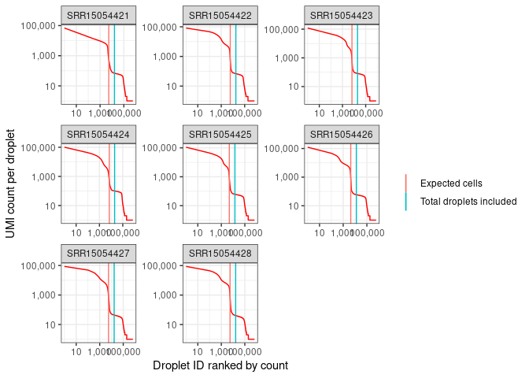<!-- -->

We could also multiply expected cells by 2.5 for all samples and save
this in our CRMetrics object.

``` r
crm$cellbender$total.droplets <- crm$getTotalDroplets(multiplier = 2.5)
```

Finally, we save a script for running `CellBender` on all our samples.
Here, we use our modified total droplet vector. If `total.droplets` is
not specified, it will use the stored vector at
`crm$cellbender$total.droplets`.

``` r
crm$saveCellbenderScript(file = "/apps/cellbender_script.sh", 
                         fpr = 0.01, 
                         epochs = 150, 
                         use.gpu = TRUE,
                         total.droplets = droplets)
```

We can run this script in the terminal. Here, we load our miniconda
module: `module load miniconda\4.12.0`, we activate the environment:
`conda activate cellbender` and we run the bash script:
`sh /apps/cellbender_script.sh`

### Plotting

We can plot the changes in cell numbers following CellBender
estimations.

``` r
crm$plotCbCells()
```

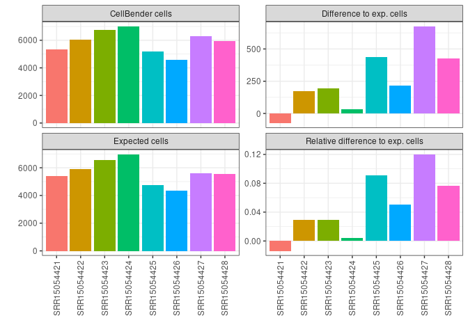<!-- -->

We can plot the CellBender training results.

``` r
crm$plotCbTraining()
```

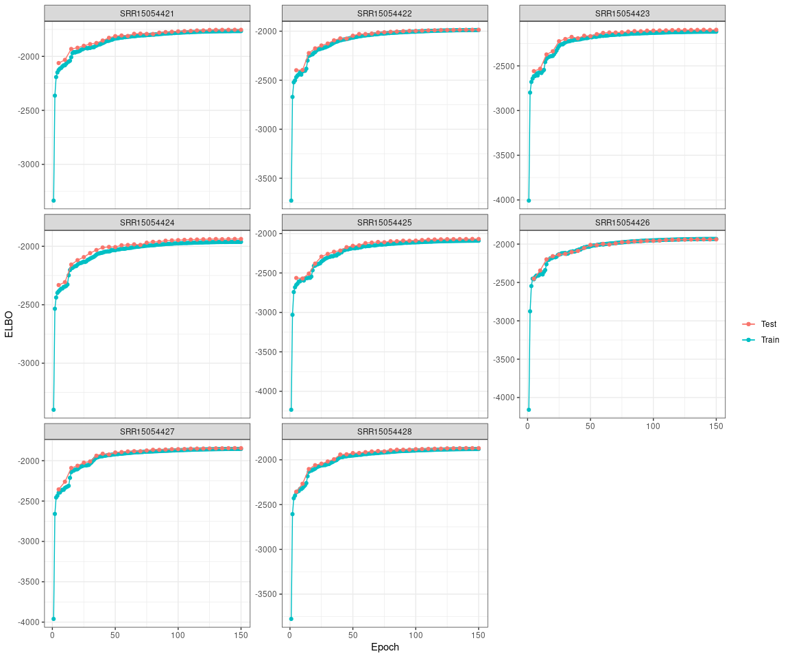<!-- -->

We can plot the cell probabilities.

``` r
crm$plotCbCellProbs()
```

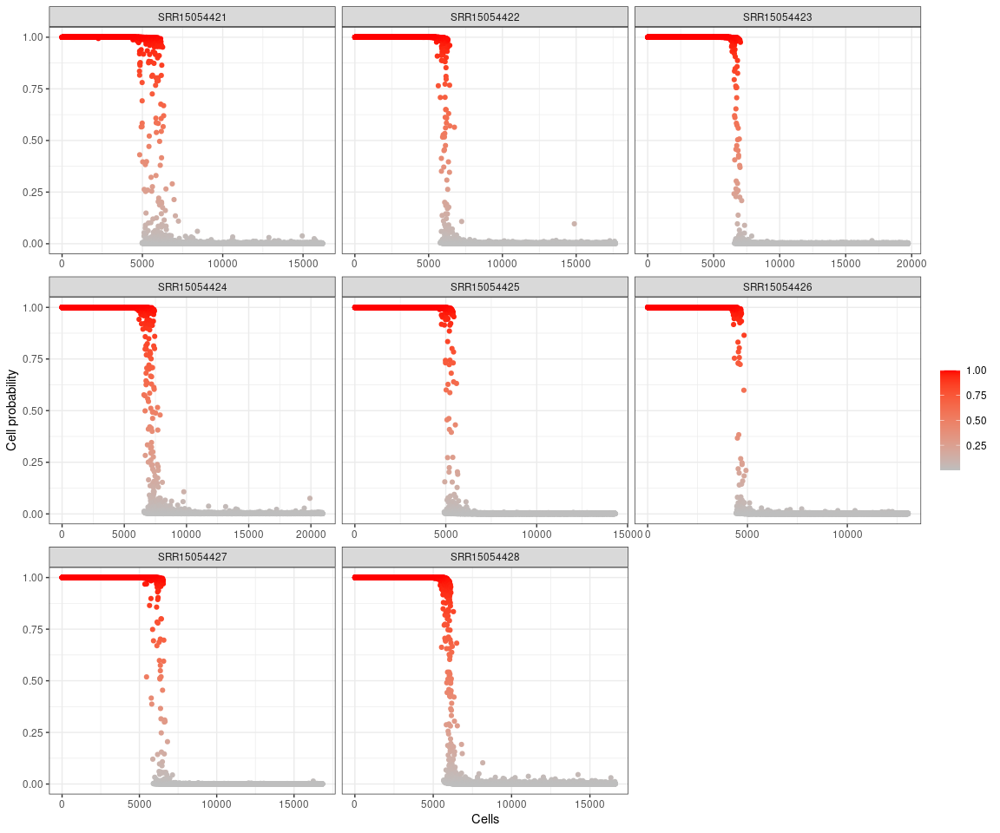<!-- -->

We can plot the identified ambient genes per sample.

``` r
crm$plotCbAmbExp(cutoff = 0.005)
```

    ## Warning: ggrepel: 4 unlabeled data points (too many overlaps). Consider
    ## increasing max.overlaps

<!-- -->

Lastly, we can plot the proportion of samples expressing ambient genes.
We see that *MALAT1* is identified as an ambient gene in all samples
[which is
expected](https://kb.10xgenomics.com/hc/en-us/articles/360004729092-Why-do-I-see-high-levels-of-Malat1-in-my-gene-expression-data-).

``` r
crm$plotCbAmbGenes(cutoff = 0.005)
```

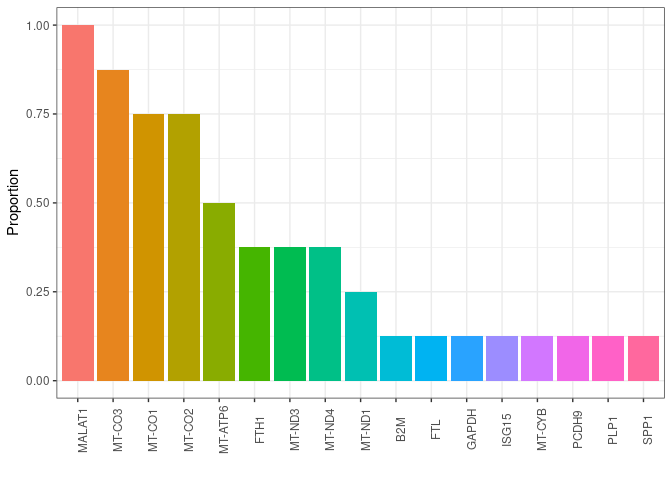<!-- -->

## SoupX

The implementation of SoupX uses the automated estimation of
contamination and correction. Please note, SoupX depends on Seurat for
import of data. Since this calculation takes several minutes, it is not
run in this vignette.

``` r
crm$runSoupX()
```

Then, we can plot the corrections.

``` r
crm$plotSoupX()
```

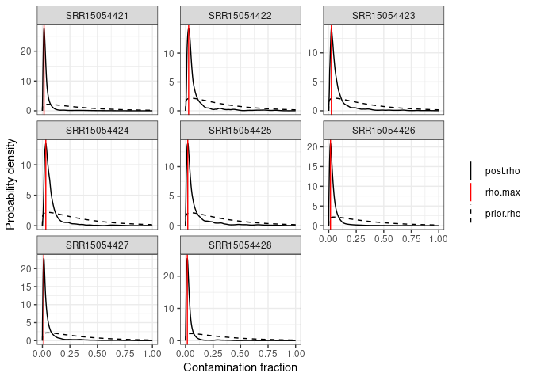<!-- -->

In the end, we add the SoupX adjusted CMs to our object.

``` r
crm$addCms(cms = crm$soupx$cms.adj, 
           unique.names = TRUE, 
           sep = "!!")
```

    ## Warning in crm$addCms(cms = crm$soupx$cms.adj, unique.names = TRUE, sep = "!!"):
    ## Consider updating detailed metrics by setting $detailed.metrics <- NULL and
    ## running $addDetailedMetrics()

    ## Warning in crm$addCms(cms = crm$soupx$cms.adj, unique.names = TRUE, sep = "!!"):
    ## Consider updating embedding by setting $cms.preprocessed <- NULL and $con <-
    ## NULL, and running $doPreprocessing() and $createEmbedding()

    ## Warning in crm$addCms(cms = crm$soupx$cms.adj, unique.names = TRUE, sep =
    ## "!!"): Consider updating doublet scores by setting $doublets <- NULL and running
    ## $detectDoublets()

# Plot summary statistics

We can investigate which metrics are available and choose the ones we
would like to plot

``` r
crm$selectMetrics()
```

    ##    no                                        metrics
    ## 1   1                      Estimated Number of Cells
    ## 2   2                            Mean Reads per Cell
    ## 3   3                          Median Genes per Cell
    ## 4   4                                Number of Reads
    ## 5   5                                 Valid Barcodes
    ## 6   6                          Sequencing Saturation
    ## 7   7                           Q30 Bases in Barcode
    ## 8   8                          Q30 Bases in RNA Read
    ## 9   9                               Q30 Bases in UMI
    ## 10 10                         Reads Mapped to Genome
    ## 11 11             Reads Mapped Confidently to Genome
    ## 12 12 Reads Mapped Confidently to Intergenic Regions
    ## 13 13   Reads Mapped Confidently to Intronic Regions
    ## 14 14     Reads Mapped Confidently to Exonic Regions
    ## 15 15      Reads Mapped Confidently to Transcriptome
    ## 16 16                 Reads Mapped Antisense to Gene
    ## 17 17                        Fraction Reads in Cells
    ## 18 18                           Total Genes Detected
    ## 19 19                     Median UMI Counts per Cell

## Samples per condition

First, we can plot the number of samples per condition. Here, we
investigate how the distribution of the sex differs between the type of
MS of the samples where RRMS is short for relapsing remitting MS, and
SPMS is short for secondary progressive MS.

``` r
crm$plotSummaryMetrics(comp.group = "sex", 
                       metrics = "samples per group", 
                       second.comp.group = "type",
                       plot.geom = "bar")
```

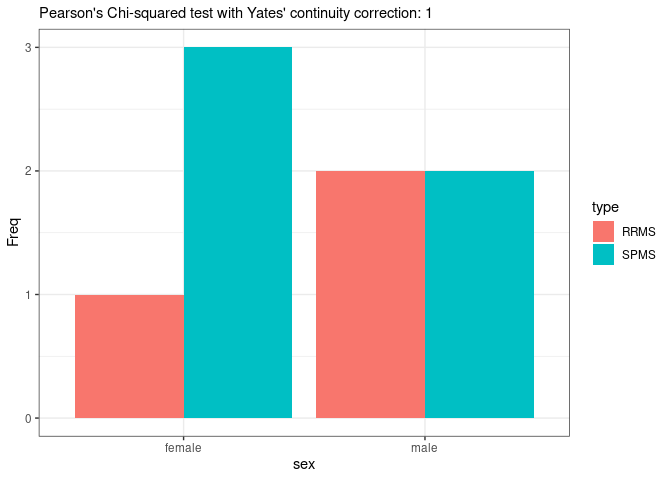<!-- -->

## Metrics per sample

In one plot, we can illustrate selected metric summary stats. If no
comparison group is set, it defaults to `sample`.

``` r
metrics.to.plot <- crm$selectMetrics(ids = c(1:4,6,18,19))
crm$plotSummaryMetrics(comp.group = "sample",
                       metrics = metrics.to.plot, 
                       plot.geom = "bar")
```

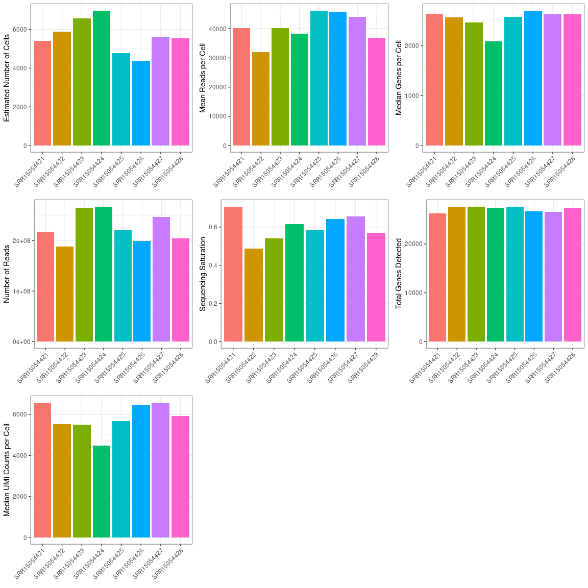<!-- -->

## Metrics per condition

We can do the same, but set the comparison group to `type`. This will
add statistics to the plots. Additionally, we can add a second
comparison group for coloring.

``` r
crm$plotSummaryMetrics(comp.group = "type",
                       metrics = metrics.to.plot, 
                       plot.geom = "point", 
                       stat.test = "non-parametric",
                       second.comp.group = "sex")
```

<!-- -->

## Metrics per condition with &gt;2 levels

For the sake of the example, we change the `RIN` values to `low`
(RIN&lt;6), `medium` (6&lt;RIN&lt;7), and `high` (RIN&gt;7). This will
provide us with three comparisons groups to exemplify how to use
automated statistics for such situations.

``` r
crm$metadata$RIN %<>% 
  as.character() %>% 
  {c("medium","high","high","medium","high","high","low","high")} %>% 
  factor(., levels = c("low", "medium", "high"))

crm$plotSummaryMetrics(comp.group = "RIN",
                       metrics = metrics.to.plot, 
                       plot.geom = "point", 
                       stat.test = "non-parametric",
                       second.comp.group = "type", 
                       secondary.testing = TRUE)
```

<!-- -->

## Metrics per condition with numeric covariate

We can choose a numeric comparison group, in this case `age`, which will
add regression lines to the plots.

``` r
crm$plotSummaryMetrics(comp.group = "age",
                       metrics = metrics.to.plot, 
                       plot.geom = "point",
                       second.comp.group = "type",
                       se = FALSE)
```

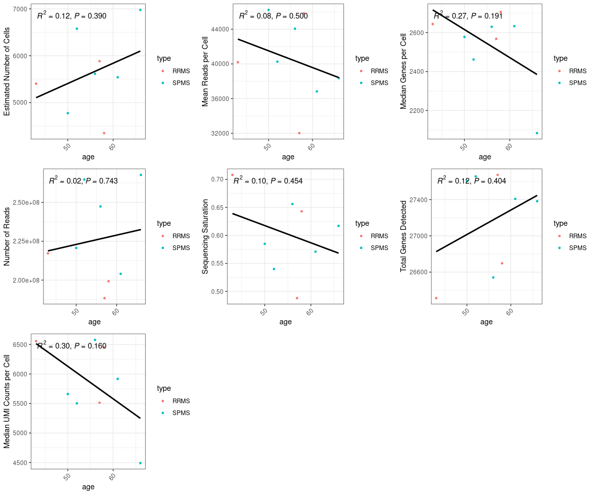<!-- -->

If the numeric vector has a significant effect on one of the metrics we
can investigate it closer by performing regression analyses for both
conditions of `type`.

``` r
crm$plotSummaryMetrics(comp.group = "age",
                       metrics = "Mean Reads per Cell", 
                       plot.geom = "point",
                       second.comp.group = "type", 
                       group.reg.lines = TRUE)
```

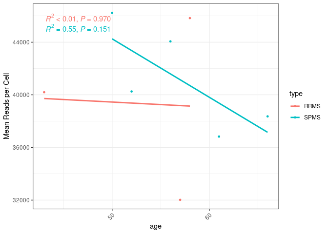<!-- -->

We see that there is no significant effect of the numeric vector on
neither of the MS types.

# Add detailed metrics

We can read in count matrices to assess detailed metrics. Otherwise, if
count matrices have already been added earlier, this step prepares data
for plotting UMI and gene counts.

``` r
crm$addDetailedMetrics()
```

We plot the detailed metrics. The horizontal lines indicates the median
values for all samples.

``` r
metrics.to.plot <- crm$detailed.metrics$metric %>%
  unique()
crm$plotDetailedMetrics(comp.group = "type",
                        metrics = metrics.to.plot, 
                        plot.geom = "violin")
```

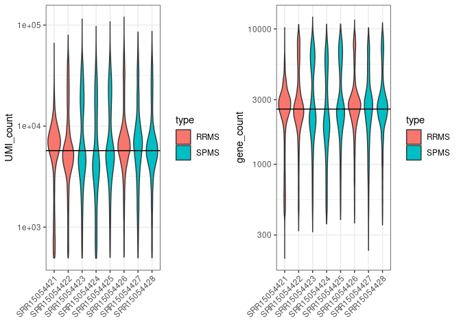<!-- -->

# Embed cells using Conos

In order to plot our cells in our embedding, we need to perform
preprocessing of the raw count matrices. To do this, either `pagoda2`
(default) or `Seurat` can be used.

``` r
crm$doPreprocessing()
```

Then, we create the embedding using `conos`.

``` r
crm$createEmbedding()
```

We can now plot our cells.

``` r
crm$plotEmbedding()
```

<!-- -->

# Cell depth

We can plot cell depth, both in the embedding or as histograms per
sample.

``` r
crm$plotEmbedding(depth = TRUE, 
             depth.cutoff = 1e3)
```

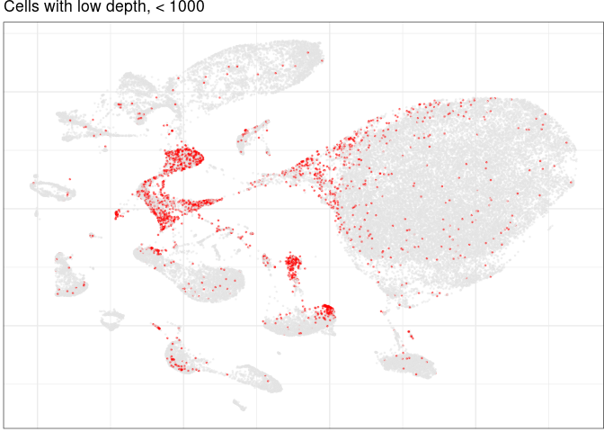<!-- -->

``` r
crm$plotDepth()
```

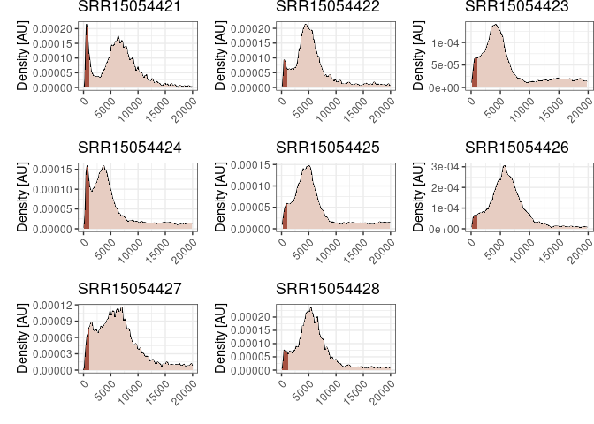<!-- -->

We can see that the depth distribution varies between samples. We can
create a cutoff vector specifying the depth cutoff per sample. It should
be a named vector containing sample names.

``` r
depth_cutoff_vec <- c(2.5e3, 2e3, 1e3, 1.5e3, 1.5e3, 2e3, 2.5e3, 2e3) %>% 
  setNames(crm$detailed.metrics$sample %>% 
             unique() %>% 
             sort())

depth_cutoff_vec
```

    ## SRR15054421 SRR15054422 SRR15054423 SRR15054424 SRR15054425 SRR15054426 
    ##        2500        2000        1000        1500        1500        2000 
    ## SRR15054427 SRR15054428 
    ##        2500        2000

Let’s plot the updated cutoffs:

``` r
crm$plotDepth(cutoff = depth_cutoff_vec)
```

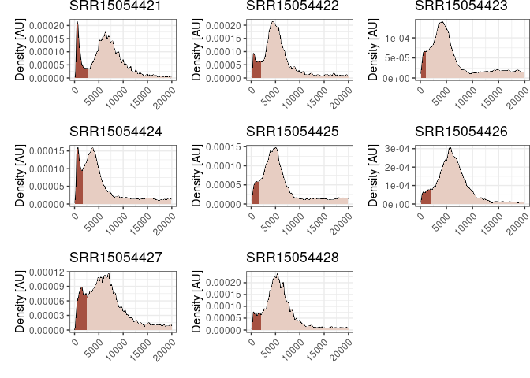<!-- -->

Also, we can do this in the embedding:

``` r
crm$plotEmbedding(depth = TRUE, 
             depth.cutoff = depth_cutoff_vec)
```

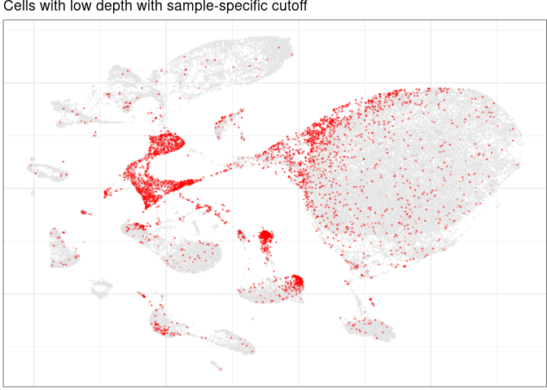<!-- -->

# Doublet detection

For doublet detection, we included the possibility to do so using the
Python modules `scrublet` and `DoubletDetection`. First, we should
install these packages:

``` r
library(reticulate)
conda_install(envname = "r-reticulate", 
              conda = "/opt/software/miniconda/4.12.0/condabin/conda", 
              pip = TRUE, 
              packages = c("scrublet","doubletdetection"))
```

`scrublet` is the default method, which is fast. `DoubletDetection` is
significantly slower, but performs better according to
[this](https://www.sciencedirect.com/science/article/pii/S2405471220304592)
review. Here, we show how to run `scrublet` and `DoubletDetection` to
compare in the next section. Since this takes some time, the results
have been precalculated and are not run in this vignette.

``` r
crm$detectDoublets(env = "r-reticulate",
                   conda.path = "/opt/software/miniconda/4.12.0/condabin/conda",
                   method = "scrublet")
crm$detectDoublets(env = "r-reticulate",
                   conda.path = "/opt/software/miniconda/4.12.0/condabin/conda",
                   method = "doubletdetection")
```

We can plot the estimated doublets in the embedding.

``` r
crm$plotEmbedding(doublet.method = "scrublet")
```

<!-- -->

``` r
crm$plotEmbedding(doublet.method = "doubletdetection")
```

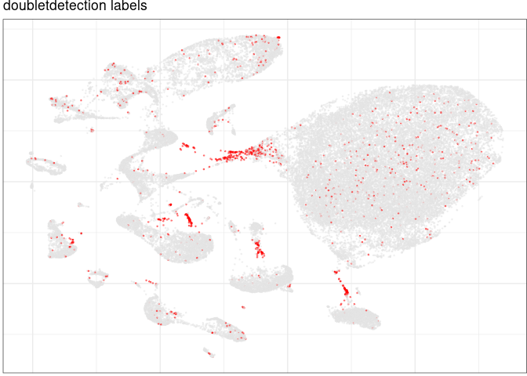<!-- -->

And we can plot the scores for the doublet estimations.

``` r
crm$plotEmbedding(doublet.method = "scrublet", 
                  doublet.scores = TRUE)
```

<!-- -->

``` r
crm$plotEmbedding(doublet.method = "doubletdetection", 
                  doublet.scores = TRUE)
```

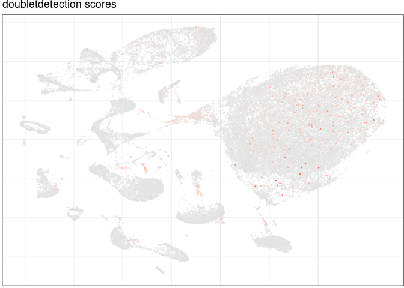<!-- -->

## Differences between methods

We can compare how much `scrublet` and `DoubletDetection` overlap in
their doublets estimates. First, let us plot a bar plot of the number of
doublets per sample.

``` r
scrub.res <- crm$doublets$scrublet$result %>% 
  select(labels, sample) %>% 
  mutate(method = "scrublet")

dd.res <- crm$doublets$doubletdetection$result %>% 
  select(labels, sample) %>% 
  mutate(labels = as.logical(labels), 
         method = "DoubletDetection")

dd.res[is.na(dd.res)] <- FALSE

plot.df <- rbind(scrub.res,
                 dd.res) %>% 
  filter(labels) %>% 
  group_by(sample, method) %>% 
  summarise(count = n())
```

    ## `summarise()` has grouped output by 'sample'. You can override using the
    ## `.groups` argument.

``` r
ggplot(plot.df, aes(sample, count, fill = method)) +
  geom_bar(stat = "identity", position = position_dodge()) +
  crm$theme +
  theme(axis.text.x = element_text(angle = 90, vjust = 0.5)) +
  labs(x = "", y = "No. doublets", fill = "Method", title = "Doublets per sample")
```

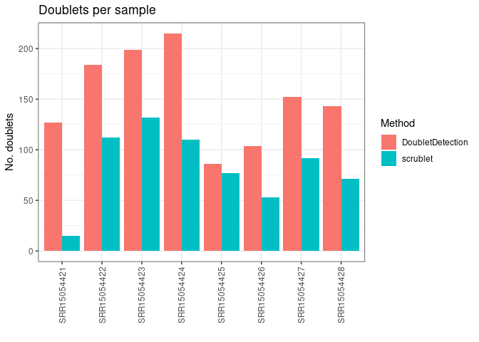<!-- -->

We can also show the total number of doublets detected per method.

``` r
plot.df %>% 
  group_by(method) %>% 
  summarise(count = sum(count)) %>% 
  ggplot(aes(method, count, fill = method)) + 
  geom_bar(stat = "identity") +
  crm$theme +
  guides(fill = "none") +
  labs(x = "", y = "No. doublets", title = "Total doublets per method")
```

<!-- -->

Finally, let’s plot an embedding showing the method-wise estimations as
well as overlaps.

``` r
plot.vec <- data.frame(scrublet = scrub.res$labels %>% as.numeric(), 
                       doubletdetection = dd.res$labels %>% as.numeric()) %>% 
  apply(1, \(x) if (x[1] == 0 & x[2] == 0) "Kept" else if (x[1] > x[2]) "scrublet" else if (x[1] < x[2]) "DoubletDetection" else "Both") %>% 
  setNames(rownames(scrub.res)) %>% 
  factor(levels = c("Kept","scrublet","DoubletDetection","Both"))

crm$con$plotGraph(groups = plot.vec, 
                  mark.groups = FALSE, 
                  show.legend = TRUE, 
                  shuffle.colors = TRUE, 
                  title = "Doublets", 
                  size = 0.3) +
  scale_color_manual(values = c("grey80","red","blue","black"))
```

    ## Scale for 'colour' is already present. Adding another scale for 'colour',
    ## which will replace the existing scale.

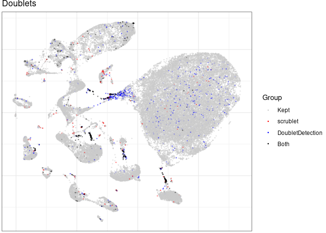<!-- -->

# Mitochondrial fraction

We can also investigate the mitochondrial fraction in our cells

``` r
crm$plotEmbedding(mito.frac = TRUE, 
             mito.cutoff = 0.05, 
             species = "human")
```

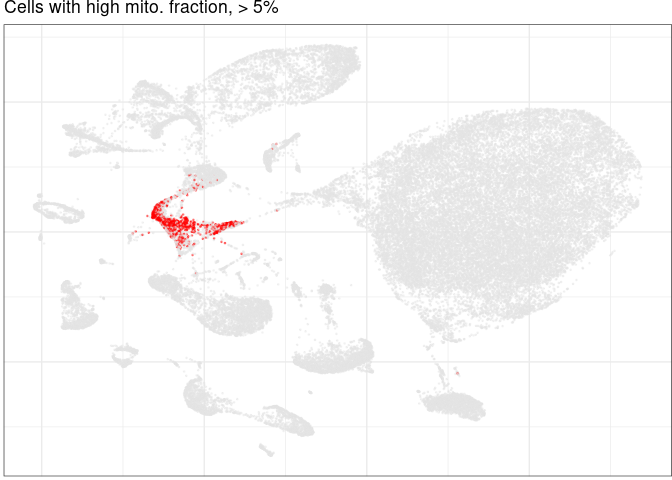<!-- -->

Similar as for depth, we can plot the distribution of the mitochondrial
fraction per sample and include sample-wise cutoffs (not shown here).

``` r
crm$plotMitoFraction(cutoff = 0.05)
```

    ## Warning: Removed 303 rows containing missing values (position_stack).

    ## Warning: Removed 160 rows containing missing values (position_stack).

    ## Warning: Removed 224 rows containing missing values (position_stack).

    ## Warning: Removed 198 rows containing missing values (position_stack).

    ## Warning: Removed 242 rows containing missing values (position_stack).

    ## Warning: Removed 266 rows containing missing values (position_stack).

    ## Warning: Removed 395 rows containing missing values (position_stack).

    ## Warning: Removed 145 rows containing missing values (position_stack).

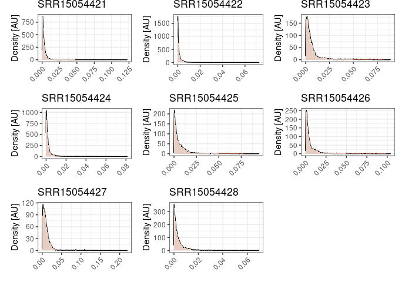<!-- -->

# Plot filtered cells

We can plot all the cells to be filtered in our embedding

``` r
crm$plotFilteredCells(type = "embedding", 
                      depth = TRUE, 
                      depth.cutoff = depth_cutoff_vec, 
                      doublet.method = "scrublet", 
                      mito.frac = TRUE, 
                      mito.cutoff = 0.05, 
                      species = "human")
```

    ## Scale for 'colour' is already present. Adding another scale for 'colour',
    ## which will replace the existing scale.

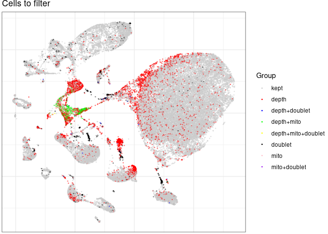<!-- -->

And we can plot the cells to be filtered per sample where `combination`
means a cell that has at least two filter labels, e.g. `mito` and
`depth`.

``` r
crm$plotFilteredCells(type = "bar", 
                      doublet.method = "scrublet", 
                      depth = TRUE, 
                      depth.cutoff = depth_cutoff_vec, 
                      mito.frac = TRUE, 
                      mito.cutoff = 0.05, 
                      species = "human")
```

<!-- -->

Finally, we can create a tile plot with an overview of sample quality
for the different filters. NB, this is experimental and has not been
validated across datasets.

``` r
crm$plotFilteredCells(type = "tile", 
                      doublet.method = "doubletdetection",
                      depth = TRUE, 
                      depth.cutoff = depth_cutoff_vec,
                      mito.frac = TRUE, 
                      mito.cutoff = 0.05, 
                      species = "human")
```

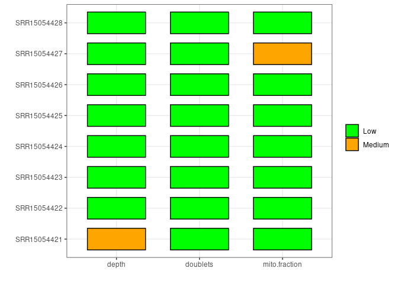<!-- -->

We can also extract the raw numbers for plotting in other ways than
those included here

``` r
filter.data <- crm$plotFilteredCells(type = "export")
filter.data %>% head()
```

    ## # A tibble: 6 × 4
    ##   sample      cell                            variable value
    ##   <chr>       <chr>                           <chr>    <dbl>
    ## 1 SRR15054421 SRR15054421!!AAACCCAAGCCACCGT-1 depth        0
    ## 2 SRR15054421 SRR15054421!!AAACCCAAGCCACCGT-1 mito         0
    ## 3 SRR15054421 SRR15054421!!AAACCCACAGTGACCC-1 depth        0
    ## 4 SRR15054421 SRR15054421!!AAACCCACAGTGACCC-1 mito         0
    ## 5 SRR15054421 SRR15054421!!AAACCCATCACAGTGT-1 depth        0
    ## 6 SRR15054421 SRR15054421!!AAACCCATCACAGTGT-1 mito         0

# Filter count matrices

Finally, we can filter the count matrices to create a cleaned list to be
used in downstream applications.

``` r
crm$filterCms(depth.cutoff = depth_cutoff_vec, 
              mito.cutoff = 0.05, 
              doublets = "doubletdetection",
              samples.to.exclude = NULL,
              species = "human")
```

The filtered list of count matrices is stored in \$cms.filtered which
can be saved on disk afterwards.

``` r
library(qs)
qsave(crm$cms.filtered, "/data/ExtData/CRMetrics_testdata/cms_filtered.qs", 
      nthreads = 10)
```

``` r
sessionInfo()
```

    ## R version 4.1.2 (2021-11-01)
    ## Platform: x86_64-redhat-linux-gnu (64-bit)
    ## Running under: Red Hat Enterprise Linux 8.5 (Ootpa)
    ## 
    ## Matrix products: default
    ## BLAS/LAPACK: /usr/lib64/libopenblas-r0.3.12.so
    ## 
    ## locale:
    ##  [1] LC_CTYPE=en_US.UTF-8       LC_NUMERIC=C              
    ##  [3] LC_TIME=en_US.UTF-8        LC_COLLATE=en_US.UTF-8    
    ##  [5] LC_MONETARY=en_US.UTF-8    LC_MESSAGES=en_US.UTF-8   
    ##  [7] LC_PAPER=en_US.UTF-8       LC_NAME=C                 
    ##  [9] LC_ADDRESS=C               LC_TELEPHONE=C            
    ## [11] LC_MEASUREMENT=en_US.UTF-8 LC_IDENTIFICATION=C       
    ## 
    ## attached base packages:
    ## [1] stats     graphics  grDevices utils     datasets  methods   base     
    ## 
    ## other attached packages:
    ## [1] dplyr_1.0.10   magrittr_2.0.3 CRMetrics_0.1  ggplot2_3.3.6 
    ## 
    ## loaded via a namespace (and not attached):
    ##   [1] drat_0.2.3              Rtsne_0.16              ggbeeswarm_0.6.0       
    ##   [4] colorspace_2.0-3        ggsignif_0.6.3          rjson_0.2.21           
    ##   [7] ellipsis_0.3.2          dendsort_0.3.4          circlize_0.4.15        
    ##  [10] GlobalOptions_0.1.2     clue_0.3-61             rstudioapi_0.14        
    ##  [13] farver_2.1.1            ggpubr_0.4.0            urltools_1.7.3         
    ##  [16] MatrixModels_0.5-0      conos_1.4.9             ggrepel_0.9.1          
    ##  [19] fansi_1.0.3             sparseMatrixStats_1.6.0 codetools_0.2-18       
    ##  [22] splines_4.1.2           R.methodsS3_1.8.2       doParallel_1.0.17      
    ##  [25] confintr_0.1.2          knitr_1.40              polynom_1.4-1          
    ##  [28] broom_1.0.1             cluster_2.1.2           png_0.1-7              
    ##  [31] R.oo_1.25.0             readr_2.1.2             compiler_4.1.2         
    ##  [34] backports_1.4.1         assertthat_0.2.1        Matrix_1.3-4           
    ##  [37] fastmap_1.1.0           cli_3.4.0               htmltools_0.5.3        
    ##  [40] quantreg_5.94           tools_4.1.2             igraph_1.3.4           
    ##  [43] gtable_0.3.1            glue_1.6.2              Rcpp_1.0.9             
    ##  [46] carData_3.0-5           rhdf5filters_1.6.0      vctrs_0.4.1            
    ##  [49] nlme_3.1-153            iterators_1.0.14        sccore_1.0.2           
    ##  [52] xfun_0.32               stringr_1.4.1           lifecycle_1.0.2        
    ##  [55] irlba_2.3.5             rstatix_0.7.0           MASS_7.3-54            
    ##  [58] scales_1.2.1            MatrixGenerics_1.6.0    hms_1.1.2              
    ##  [61] parallel_4.1.2          rhdf5_2.38.1            SparseM_1.81           
    ##  [64] RColorBrewer_1.1-3      qs_0.25.4               ComplexHeatmap_2.10.0  
    ##  [67] yaml_2.3.5              gridExtra_2.3           ggpmisc_0.5.0          
    ##  [70] triebeard_0.3.0         stringi_1.7.8           highr_0.9              
    ##  [73] Rook_1.1-1              S4Vectors_0.32.4        foreach_1.5.2          
    ##  [76] BiocGenerics_0.40.0     boot_1.3-28             ggpp_0.4.4             
    ##  [79] shape_1.4.6             rlang_1.0.5             pkgconfig_2.0.3        
    ##  [82] matrixStats_0.62.0      RMTstat_0.3.1           evaluate_0.16          
    ##  [85] lattice_0.20-45         Rhdf5lib_1.16.0         N2R_1.0.1              
    ##  [88] purrr_0.3.4             pagoda2_1.0.10          labeling_0.4.2         
    ##  [91] leidenAlg_1.0.5         cowplot_1.1.1           tidyselect_1.1.2       
    ##  [94] R6_2.5.1                IRanges_2.28.0          generics_0.1.3         
    ##  [97] DBI_1.1.3               pillar_1.8.1            withr_2.5.0            
    ## [100] mgcv_1.8-38             survival_3.2-13         abind_1.4-5            
    ## [103] tibble_3.1.8            crayon_1.5.1            car_3.1-0              
    ## [106] utf8_1.2.2              RApiSerialize_0.1.2     tzdb_0.3.0             
    ## [109] rmarkdown_2.16          GetoptLong_1.0.5        grid_4.1.2             
    ## [112] digest_0.6.29           tidyr_1.2.1             brew_1.0-7             
    ## [115] R.utils_2.12.0          RcppParallel_5.1.5      stats4_4.1.2           
    ## [118] munsell_0.5.0           stringfish_0.15.7       beeswarm_0.4.0         
    ## [121] vipor_0.4.5
