Analysis of 10x test data
================

-   <a href="#preparations" id="toc-preparations">Preparations</a>
-   <a href="#using-python-modules" id="toc-using-python-modules">Using
    Python modules</a>
-   <a href="#initializing-a-crmetrics-class"
    id="toc-initializing-a-crmetrics-class">Initializing a CRMetrics
    class</a>
-   <a href="#remove-ambient-rna" id="toc-remove-ambient-rna">Remove ambient
    RNA</a>
    -   <a href="#cellbender" id="toc-cellbender">CellBender</a>
        -   <a href="#installation" id="toc-installation">Installation</a>
        -   <a href="#analysis" id="toc-analysis">Analysis</a>
        -   <a href="#plotting" id="toc-plotting">Plotting</a>
    -   <a href="#soupx" id="toc-soupx">SoupX</a>
-   <a href="#plot-summary-statistics" id="toc-plot-summary-statistics">Plot
    summary statistics</a>
    -   <a href="#samples-per-condition" id="toc-samples-per-condition">Samples
        per condition</a>
    -   <a href="#metrics-per-sample" id="toc-metrics-per-sample">Metrics per
        sample</a>
    -   <a href="#metrics-per-condition" id="toc-metrics-per-condition">Metrics
        per condition</a>
    -   <a href="#metrics-per-condition-with-2-levels"
        id="toc-metrics-per-condition-with-2-levels">Metrics per condition with
        &gt;2 levels</a>
    -   <a href="#metrics-per-condition-with-numeric-covariate"
        id="toc-metrics-per-condition-with-numeric-covariate">Metrics per
        condition with numeric covariate</a>
-   <a href="#add-detailed-metrics" id="toc-add-detailed-metrics">Add
    detailed metrics</a>
-   <a href="#embed-cells-using-conos-and-umap"
    id="toc-embed-cells-using-conos-and-umap">Embed cells using Conos and
    UMAP</a>
-   <a href="#cell-depth" id="toc-cell-depth">Cell depth</a>
-   <a href="#doublet-detection" id="toc-doublet-detection">Doublet
    detection</a>
    -   <a href="#differences-between-methods"
        id="toc-differences-between-methods">Differences between methods</a>
        -   <a href="#umap" id="toc-umap">UMAP</a>
-   <a href="#mitochondrial-fraction"
    id="toc-mitochondrial-fraction">Mitochondrial fraction</a>
-   <a href="#plot-filtered-cells" id="toc-plot-filtered-cells">Plot
    filtered cells</a>
-   <a href="#save-filtered-cms" id="toc-save-filtered-cms">Save filtered
    CMs</a>

# Preparations

We have selected a [publicly available
dataset](https://www.ncbi.nlm.nih.gov/geo/) from GEO with accession
number GSE179590 which can be downloaded
[here](http://kkh.bric.ku.dk/fabienne/crmetrics_testdata.tar.gz). You
can download the zipped data using wget or curl, e.g. 
`wget http://kkh.bric.ku.dk/fabienne/crmetrics_testdata.tar.gz`, and
then unpack using `tar -xvf crmetrics_testdata.tar.gz`

# Using Python modules

We have included several Python modules in this package. If you work on
a server using RStudio Server, there may be some preparational steps
needed for getting the doublet detection to work. If you are on your own
machine, it should be enough to install `reticulate` and the relevant
Python module(s).

First, you should install `reticulate`:

``` r
install.packages("reticulate")
library(reticulate)
```

Then you are ready to create a conda environment. In this example, we’re
on a server and we load `miniconda` using modules. The `conda` parameter
should point to wherever your conda binary is located (in terminal, try
`whereis conda`)

``` r
conda_create("r-reticulate", 
             conda = "/opt/software/miniconda/4.12.0/condabin/conda", 
             python_version = 3.8)
```

There is a known problem with openBLAS which may be different between R
and Python. If this is the case, you will receive the error
`floating point exception` and R will crash when you try to run a Python
script using `reticulate`. In Python, the problem lies within numpy.
numba requires numpy \< 1.23, so force reinstall from scratch with no
binaries in the `r-reticulate` conda environment from terminal
`module load miniconda/4.12.0` `conda activate r-reticulate`
`python -m pip install numpy==1.22.0 --force-reinstall --no-binary numpy`

Finally, restart your R session.

Please note, if at any point you receive an error that you can’t change
the current Python instance, please remove any Python-dependent object
in your environment and restart your R session.

# Initializing a CRMetrics class

Load the library

``` r
library(CRMetrics)
library(magrittr)
library(dplyr)
```

Initialize a new object of class `CRMetrics` with the path to the Cell
Ranger output and a metadata file. Here, the folder with our test data
is stored in `/data/ExtData/`. Metadata can be added in the
initialization call from a comma-separated file. The metadata file
contains a column `sample` with the samples and optionally more columns
with factors. Only sample IDs in column `sample` will be included.

``` r
crm <- CRMetrics$new(data.path = "/data/ExtData/CRMetrics_testdata/", 
                     metadata = "/data/ExtData/CRMetrics_testdata/metadata.csv", 
                     n.cores = 50)
```

    ## 2022-09-13 11:42:46 Adding 8 samples

    ## 2022-09-13 11:42:47 Done!

We can review our metadata

``` r
crm$metadata
```

    ## # A tibble: 8 × 5
    ##   sample        age sex    type    RIN
    ##   <fct>       <int> <fct>  <fct> <dbl>
    ## 1 SRR15054421    43 male   RRMS    6.7
    ## 2 SRR15054422    57 male   RRMS    7.3
    ## 3 SRR15054423    52 male   SPMS    7.6
    ## 4 SRR15054424    66 female SPMS    6.7
    ## 5 SRR15054425    50 female SPMS    7.8
    ## 6 SRR15054426    58 female RRMS    7.5
    ## 7 SRR15054427    56 female SPMS    5  
    ## 8 SRR15054428    61 male   SPMS    7.4

# Remove ambient RNA

We have added functionality to remove ambient RNA from our samples. This
approach should be used with caution since it induces changes to the UMI
counts (NB: it does not overwrite the outputs from Cell Ranger). We have
included preparative steps for
[CellBender](https://github.com/broadinstitute/CellBender/) as well as
incorporated [SoupX](https://github.com/constantAmateur/SoupX) into
CRMetrics.

## CellBender

### Installation

To install, follow [these
instructions](https://cellbender.readthedocs.io/en/latest/installation/index.html#manual-installation).
It is highly recommended to run `CellBender` using GPU acceleration. If
you are more comfortable installing through `reticulate` in R, these
lines should be run:

``` r
library(reticulate)
conda_create("cellbender", 
             conda = "/opt/software/miniconda/4.12.0/condabin/conda", 
             python_version = 3.7)
conda_install("cellbender", 
              conda = "/opt/software/miniconda/4.12.0/condabin/conda", 
              forge = FALSE, 
              channel = "anaconda", 
              packages = "pytables")
conda_install("cellbender", 
              conda = "/opt/software/miniconda/4.12.0/condabin/conda", 
              packages = c("pytorch","torchvision","torchaudio"),
              channel = "pytorch")
```

Then, clone the `CellBender` repository as instructed in the manual.
Here, we clone to `/apps/` through
`cd /apps/; git clone https://github.com/broadinstitute/CellBender.git`
and then `CellBender` can be installed:

``` r
conda_install("cellbender", 
              conda = "/opt/software/miniconda/4.12.0/condabin/conda", 
              pip = TRUE, 
              pip_options = "-e", 
              packages = "/apps/CellBender/")
```

### Analysis

For `CellBender`, we need to specify expected number of cells and total
droplets included (please see the
[manual](https://cellbender.readthedocs.io/en/latest/usage/index.html)
for additional information). As hinted in the manual, the number of
total droplets included could be expected number of cells multiplied by
3 (which we set as default). First, we plot these measures:

``` r
crm$prepareCellbender(shrinkage = 100, # Subsamples every 100th datapoint for faster plotting
                      show.expected.cells = TRUE, 
                      show.total.droplets = TRUE)
```

    ## 2022-09-13 11:42:48 Started run using 8 cores

    ## 2022-09-13 11:42:48 Loading HDF5 Cell Ranger outputs

    ## Loading required namespace: rhdf5

    ## 2022-09-13 11:42:48 Loading 8 count matrices using 8 cores

    ## 2022-09-13 11:43:25 Done!

    ## 2022-09-13 11:43:25 Calculating UMI counts per sample

    ## 2022-09-13 11:43:29 Plotting

    ## 2022-09-13 11:43:30 Done!

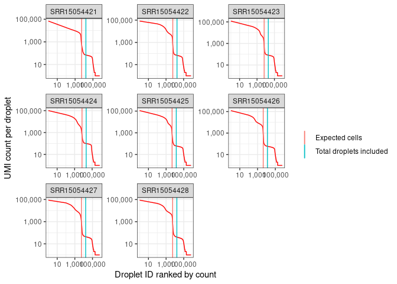<!-- -->

We could change the total droplets included for any sample. Let us first
look at the vector.

``` r
droplets <- crm$getTotalDroplets()
droplets
```

    ## SRR15054421 SRR15054422 SRR15054423 SRR15054424 SRR15054425 SRR15054426 
    ##       16212       17652       19728       20931       14322       13044 
    ## SRR15054427 SRR15054428 
    ##       16842       16620

Then we change the total droplets for SRR15054424.

``` r
droplets["SRR15054424"] <- 2e4
```

We plot this change.

``` r
crm$prepareCellbender(shrinkage = 100, 
                      show.expected.cells = TRUE, 
                      show.total.droplets = TRUE, 
                      total.droplets = droplets)
```

    ## 2022-09-13 11:43:34 Started run using 8 cores

    ## 2022-09-13 11:43:34 Using stored HDF5 Cell Ranger outputs. To overwrite, set $cms.raw <- NULL

    ## 2022-09-13 11:43:34 Using stored UMI counts calculations. To overwrite, set $cellbender$umi.counts <- NULL

    ## 2022-09-13 11:43:34 Plotting

    ## 2022-09-13 11:43:34 Done!

<!-- -->

We could also multiply expected cells by 4 for all samples and save this
in our CRMetrics object.

``` r
crm$cellbender$total.droplets <- crm$getTotalDroplets(multiplier = 4)
```

Finally, we save a script for running `CellBender` on all our samples.
Here, we use our modified total droplet vector.

``` r
crm$saveCellbenderScript(file = "/apps/cellbender_script.sh", 
                         fpr = 0.01, 
                         epochs = 150, 
                         use.gpu = TRUE,
                         total.droplets = droplets)
```

We can run this script in the terminal. Here, we load our miniconda
module: `module load miniconda\4.12.0`, we activate the environment:
`conda activate cellbender` and we run the bash script:
`sh /apps/cellbender_script.sh`

### Plotting

``` r
crm$plotCbCells()
```

<!-- -->

``` r
crm$plotCbTraining()
```

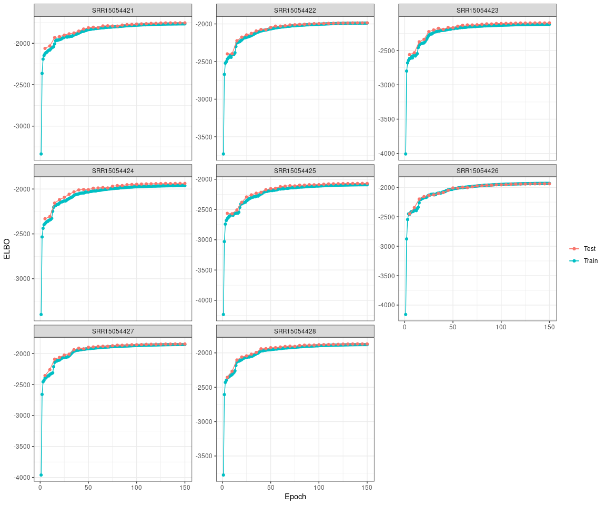<!-- -->

``` r
crm$plotCbCellProbs()
```

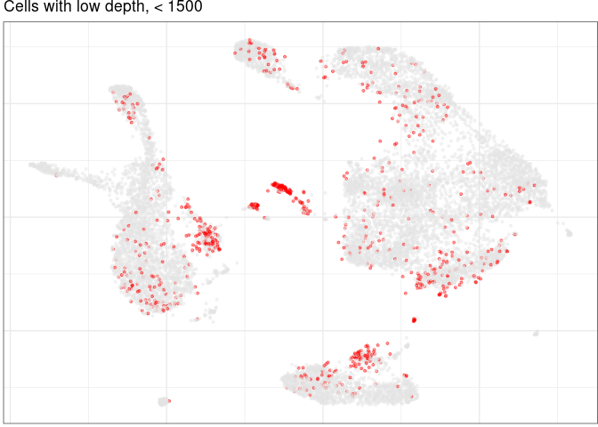<!-- -->

``` r
crm$plotCbAmbExp()
```

    ## Warning: ggrepel: 4 unlabeled data points (too many overlaps). Consider
    ## increasing max.overlaps

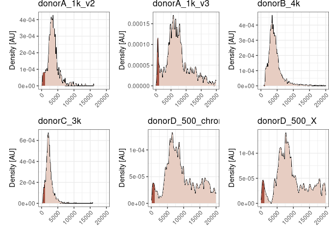<!-- -->

``` r
crm$plotCbAmbGenes()
```

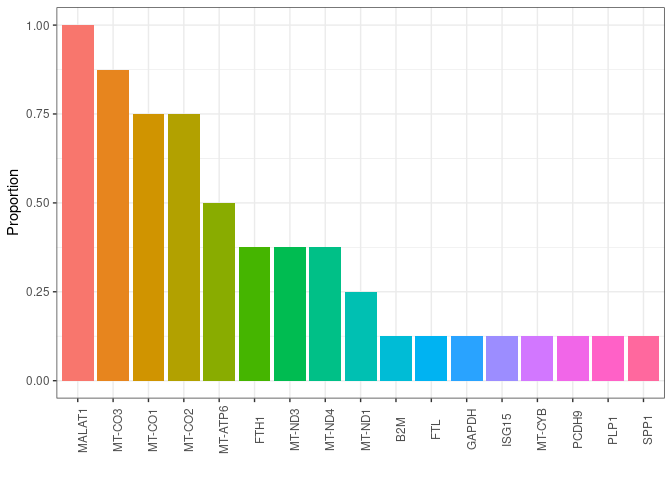<!-- -->

## SoupX

The implementation of SoupX uses the automated estimation of
contamination and correction.

``` r
crm$runSoupX()
```

    ## Loading required namespace: SoupX

    ## 2022-09-13 11:44:04 Running using 8 cores

    ## 2022-09-13 11:44:04 Loading data

    ## 2022-09-13 11:44:46 Estimating contamination

    ## 2022-09-13 11:45:12 Preparing plot data

    ## 2022-09-13 11:45:12 Adjusting counts

    ## 2022-09-13 11:45:49 Done!

Then, we can plot the corrections.

``` r
crm$plotSoupX()
```

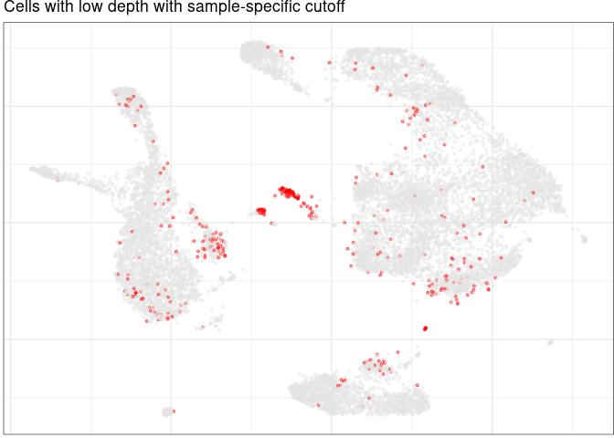<!-- -->

In the end, we add the SoupX adjusted CMs to our object.

``` r
crm$addCms(crm$soupx$cms.adj)
```

# Plot summary statistics

We can investigate which metrics are available and choose the ones we
would like to plot

``` r
crm$selectMetrics()
```

    ##    no                                        metrics
    ## 1   1                      Estimated Number of Cells
    ## 2   2                            Mean Reads per Cell
    ## 3   3                          Median Genes per Cell
    ## 4   4                                Number of Reads
    ## 5   5                                 Valid Barcodes
    ## 6   6                          Sequencing Saturation
    ## 7   7                           Q30 Bases in Barcode
    ## 8   8                          Q30 Bases in RNA Read
    ## 9   9                               Q30 Bases in UMI
    ## 10 10                         Reads Mapped to Genome
    ## 11 11             Reads Mapped Confidently to Genome
    ## 12 12 Reads Mapped Confidently to Intergenic Regions
    ## 13 13   Reads Mapped Confidently to Intronic Regions
    ## 14 14     Reads Mapped Confidently to Exonic Regions
    ## 15 15      Reads Mapped Confidently to Transcriptome
    ## 16 16                 Reads Mapped Antisense to Gene
    ## 17 17                        Fraction Reads in Cells
    ## 18 18                           Total Genes Detected
    ## 19 19                     Median UMI Counts per Cell

## Samples per condition

First, we can plot the number of samples per condition. Here, we
investigate how the distribution of the sex differs between the type of
MS of the samples where RRMS is short for relapsing remitting MS, and
SPMS is short for secondary progressive MS.

``` r
crm$plotSummaryMetrics(comp.group = "sex", metrics = "samples per group", second.comp.group = "type")
```

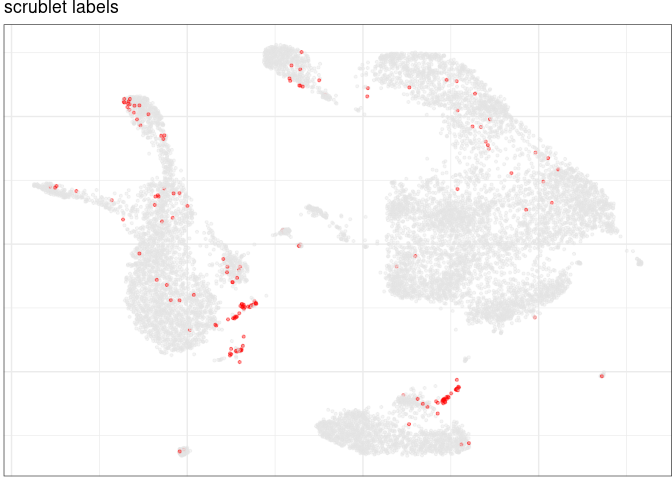<!-- -->

## Metrics per sample

In one plot, we can illustrate selected metric summary stats. If no
comparison group is set, it defaults to `sample`.

``` r
metrics.to.plot <- crm$selectMetrics(ids = c(1:4,6,18,19))
crm$plotSummaryMetrics(metrics = metrics.to.plot, 
                       plot.geom = "point")
```

    ## Using 'sample' for 'comp.group'

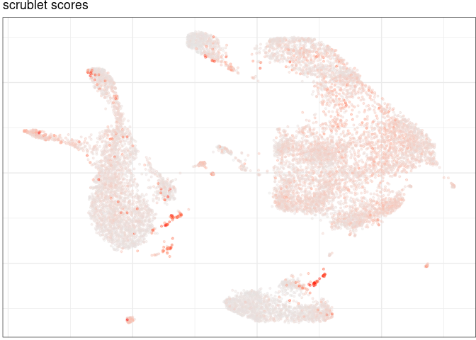<!-- -->

## Metrics per condition

We can do the same, but set the comparison group to `type`. This will
add statistics to the plots. Additionally, we can add a second
comparison group for coloring.

``` r
crm$addComparison("type")
crm$plotSummaryMetrics(metrics = metrics.to.plot, 
                       plot.geom = "point", 
                       stat.test = "non-parametric",
                       second.comp.group = "sex")
```

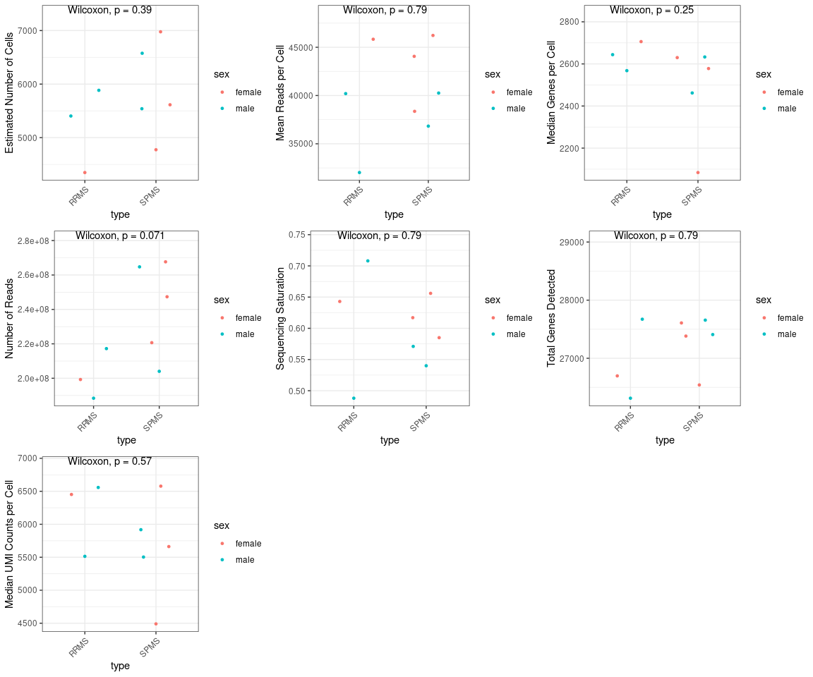<!-- -->

## Metrics per condition with \>2 levels

For the sake of the example, we change the `RIN` values to `low`
(RIN\<6), `medium` (6\<RIN\<7), and `high` (RIN\>7). This will provide
us with three comparisons groups to exemplify how to use automated
statistics for such situations.

``` r
crm$metadata$RIN %<>% 
  as.character() %>% 
  {c("medium","high","high","medium","high","high","low","high")} %>% 
  factor(., levels = c("low", "medium", "high"))

crm$plotSummaryMetrics(comp.group = "RIN",
                       metrics = metrics.to.plot, 
                       plot.geom = "point", 
                       stat.test = "non-parametric",
                       second.comp.group = "type", 
                       secondary.testing = TRUE)
```

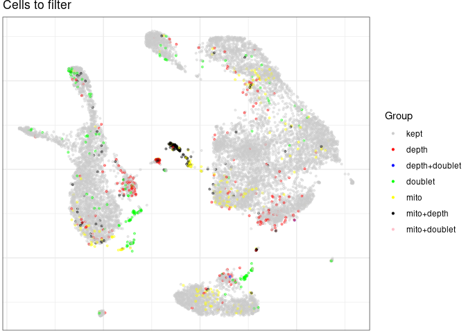<!-- -->

## Metrics per condition with numeric covariate

We can choose a numeric comparison group, in this case `age`, which will
add regression lines to the plots.

``` r
crm$plotSummaryMetrics(comp.group = "age",
                       metrics = metrics.to.plot, 
                       plot.geom = "point",
                       second.comp.group = "type",
                       se = FALSE)
```

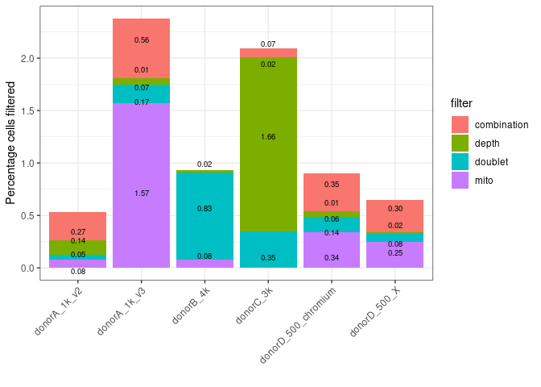<!-- -->

If the numeric vector has a significant effect on one of the metrics we
can investigate it closer by performing regression analyses for both
conditions of `type`.

``` r
crm$plotSummaryMetrics(comp.group = "age",
                       metrics = "Mean Reads per Cell", 
                       plot.geom = "point",
                       second.comp.group = "type", 
                       group.reg.lines = TRUE)
```

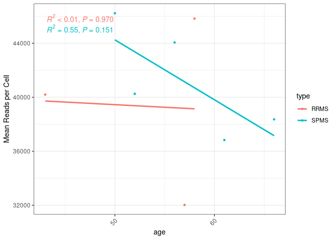<!-- -->

We see that there is no significant effect of the numeric vector on
neither of the MS types.

# Add detailed metrics

We can read in count matrices to assess detailed metrics. Otherwise, if
count matrices have already been added earlier, this step prepares data
for plotting UMI and gene counts.

``` r
crm$addDetailedMetrics()
```

    ## Filtered CMs already present. To overwrite, set $cms = NULL and rerun this function.

    ## 2022-09-13 11:46:06 Counting using 8 cores

    ## 2022-09-13 11:46:14 Creating table

    ## 2022-09-13 11:46:15 Done!

We plot the detailed metrics. The horizontal lines indicates the median
values for all samples.

``` r
metrics.to.plot <- crm$detailed.metrics$metric %>%
  unique()
crm$plotDetailedMetrics(metrics = metrics.to.plot, 
                        plot.geom = "violin")
```

<!-- -->

# Embed cells using Conos and UMAP

In order to plot our cells in a UMAP embedding, we need to perform
preprocessing of the raw count matrices. To do this, either `pagoda2`
(default) or `Seurat` can be used.

``` r
crm$doPreprocessing()
```

    ## Running preprocessing using pagoda2...

    ## Loading required namespace: pagoda2

    ## 5404 cells, 33538 genes; normalizing ...

    ## Using plain model

    ## Winsorizing ...

    ## log scale ...

    ## done.

    ## calculating variance fit ...

    ##  using gam

    ## 2196 overdispersed genes ... 2196

    ## persisting ...

    ## done.

    ## running PCA using 3000 OD genes .

    ## .
    ## .
    ## .

    ##  done

    ## creating space of type angular done
    ## adding data ... done
    ## building index ... done
    ## querying ... done

    ## 5884 cells, 33538 genes; normalizing ...

    ## Using plain model

    ## Winsorizing ...

    ## log scale ...

    ## done.

    ## calculating variance fit ...

    ##  using gam

    ## 2748 overdispersed genes ... 2748

    ## persisting ...

    ## done.

    ## running PCA using 3000 OD genes .

    ## .
    ## .
    ## .

    ##  done

    ## creating space of type angular done
    ## adding data ... done
    ## building index ... done
    ## querying ... done

    ## 6576 cells, 33538 genes; normalizing ...

    ## Using plain model

    ## Winsorizing ...

    ## log scale ...

    ## done.

    ## calculating variance fit ...

    ##  using gam

    ## 3265 overdispersed genes ... 3265

    ## persisting ...

    ## done.

    ## running PCA using 3000 OD genes .

    ## .
    ## .
    ## .

    ##  done

    ## creating space of type angular done
    ## adding data ... done
    ## building index ... done
    ## querying ... done

    ## 6977 cells, 33538 genes; normalizing ...

    ## Using plain model

    ## Winsorizing ...

    ## log scale ...

    ## done.

    ## calculating variance fit ...

    ##  using gam

    ## 2692 overdispersed genes ... 2692

    ## persisting ...

    ## done.

    ## running PCA using 3000 OD genes .

    ## .
    ## .
    ## .

    ##  done

    ## creating space of type angular done
    ## adding data ... done
    ## building index ... done
    ## querying ... done

    ## 4774 cells, 33538 genes; normalizing ...

    ## Using plain model

    ## Winsorizing ...

    ## log scale ...

    ## done.

    ## calculating variance fit ...

    ##  using gam

    ## 2600 overdispersed genes ... 2600

    ## persisting ...

    ## done.

    ## running PCA using 3000 OD genes .

    ## .
    ## .
    ## .

    ##  done

    ## creating space of type angular done
    ## adding data ... done
    ## building index ... done
    ## querying ... done

    ## 4348 cells, 33538 genes; normalizing ...

    ## Using plain model

    ## Winsorizing ...

    ## log scale ...

    ## done.

    ## calculating variance fit ...

    ##  using gam

    ## 2203 overdispersed genes ... 2203

    ## persisting ...

    ## done.

    ## running PCA using 3000 OD genes .

    ## .
    ## .
    ## .

    ##  done

    ## creating space of type angular done
    ## adding data ... done
    ## building index ... done
    ## querying ... done

    ## 5614 cells, 33538 genes; normalizing ...

    ## Using plain model

    ## Winsorizing ...

    ## log scale ...

    ## done.

    ## calculating variance fit ...

    ##  using gam

    ## 2257 overdispersed genes ... 2257

    ## persisting ...

    ## done.

    ## running PCA using 3000 OD genes .

    ## .
    ## .
    ## .

    ##  done

    ## creating space of type angular done
    ## adding data ... done
    ## building index ... done
    ## querying ... done

    ## 5540 cells, 33538 genes; normalizing ...

    ## Using plain model

    ## Winsorizing ...

    ## log scale ...

    ## done.

    ## calculating variance fit ...

    ##  using gam

    ## 2347 overdispersed genes ... 2347

    ## persisting ...

    ## done.

    ## running PCA using 3000 OD genes .

    ## .
    ## .
    ## .

    ##  done

    ## creating space of type angular done
    ## adding data ... done
    ## building index ... done
    ## querying ... done

    ## Preprocessing done!

Then, we create the UMAP embedding using `conos`.

``` r
crm$createEmbedding()
```

    ## Loading required namespace: conos

    ## Creating Conos object...

    ## Building graph...

    ## found 0 out of 28 cached PCA space pairs ...

    ## running 28 additional PCA space pairs

    ##  done

    ## inter-sample links using mNN

    ##  done

    ## local pairs

    ##  done

    ## building graph .

    ## .

    ## done

    ## Finding communities...

    ## Creating UMAP embedding...

    ## Convert graph to adjacency list...

    ## Done

    ## Estimate nearest neighbors and commute times...

    ## Estimating hitting distances: 11:47:57.
    ## Done.
    ## Estimating commute distances: 11:48:10.
    ## Hashing adjacency list: 11:48:10.
    ## Done.
    ## Estimating distances: 11:48:15.
    ## Done
    ## Done.
    ## All done!: 11:48:27.

    ## Done

    ## Estimate UMAP embedding...

    ## 11:48:27 UMAP embedding parameters a = 0.0267 b = 0.7906

    ## 11:48:27 Converting dataframe to numerical matrix

    ## 11:48:27 Read 45117 rows and found 1 numeric columns

    ## 11:48:29 Commencing smooth kNN distance calibration using 50 threads with target n_neighbors = 41
    ## 11:48:34 Initializing from normalized Laplacian + noise (using irlba)
    ## 11:48:40 Commencing optimization for 1000 epochs, with 1417282 positive edges using 50 threads
    ## 11:49:03 Optimization finished
    ## Done

We can now plot our cells.

``` r
crm$plotUmap()
```

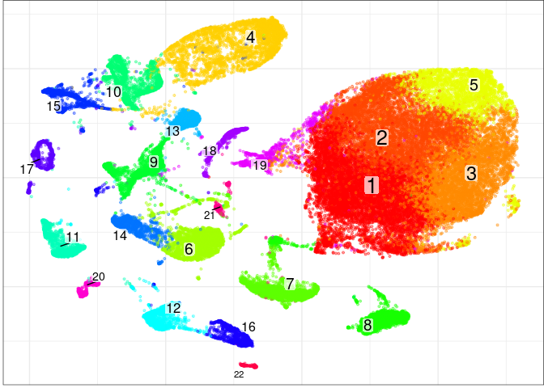<!-- -->

# Cell depth

We can plot cell depth, both in the UMAP embedding or as histograms per
sample.

``` r
crm$plotUmap(depth = TRUE, 
             depth.cutoff = 1.5e3)
```

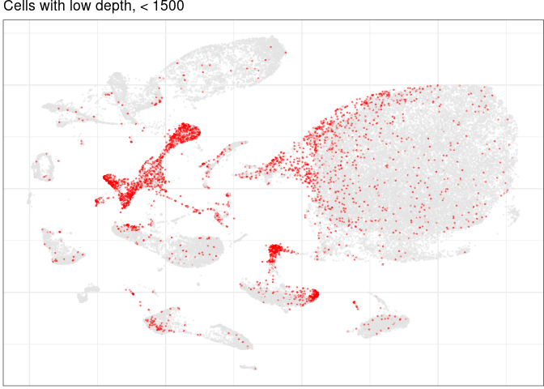<!-- -->

``` r
crm$plotDepth()
```

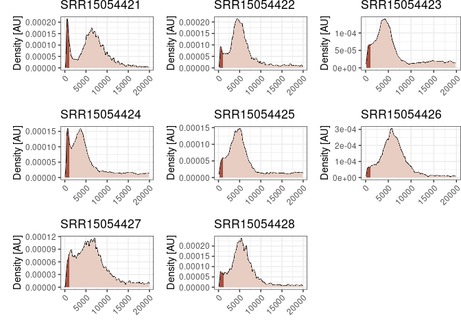<!-- -->

We can see that the depth distribution varies between samples. We can
create a cutoff vector specifying the depth cutoff per sample. It should
be a named vector containing sample names.

``` r
depth_cutoff_vec <- c(2.5e3, 2e3, 1e3, 1.5e3, 1.5e3, 2e3, 2.5e3, 2e3) %>% 
  setNames(crm$detailed.metrics$sample %>% unique() %>% sort())

depth_cutoff_vec
```

    ## SRR15054421 SRR15054422 SRR15054423 SRR15054424 SRR15054425 SRR15054426 
    ##        2500        2000        1000        1500        1500        2000 
    ## SRR15054427 SRR15054428 
    ##        2500        2000

Let’s plot the updated cutoffs:

``` r
crm$plotDepth(cutoff = depth_cutoff_vec)
```

<!-- -->

Also, we can do this in the UMAP embedding:

``` r
crm$plotUmap(depth = TRUE, 
             depth.cutoff = depth_cutoff_vec)
```

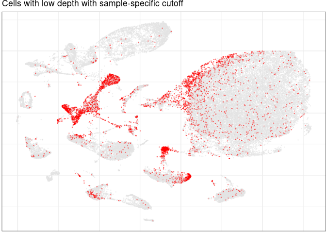<!-- -->

# Doublet detection

For doublet detection, we included the possibility to do so using the
Python modules `scrublet` and `DoubletDetection`. First, we should
install these packages:

``` r
library(reticulate)
conda_install("r-reticulate", 
              conda = "/opt/software/miniconda/4.12.0/condabin/conda", 
              pip = TRUE, 
              packages = c("scrublet","doubletdetection"))
```

`scrublet` is the default method, which is fast. `DoubletDetection` is
significantly slower, but performs better according to
[this](https://www.sciencedirect.com/science/article/pii/S2405471220304592)
review. Here, we run `scrublet` and `DoubletDetection` to compare in the
next section.

``` r
crm$detectDoublets(conda.path = "/opt/software/miniconda/4.12.0/condabin/conda",
                   method = "scrublet")
```

    ## Loading prerequisites...

    ## Identifying doublets using 'scrublet'...

    ## Running sample 'SRR15054421'...

    ## Running sample 'SRR15054422'...

    ## Running sample 'SRR15054423'...

    ## Running sample 'SRR15054424'...

    ## Running sample 'SRR15054425'...

    ## Running sample 'SRR15054426'...

    ## Running sample 'SRR15054427'...

    ## Running sample 'SRR15054428'...

    ## Detected 662 possible doublets out of 45117 cells.

``` r
crm$detectDoublets(conda.path = "/opt/software/miniconda/4.12.0/condabin/conda",
                   method = "doubletdetection")
```

    ## Loading prerequisites...

    ## Identifying doublets using 'doubletdetection'...

    ## Running sample 'SRR15054421'...

    ## Running sample 'SRR15054422'...

    ## Running sample 'SRR15054423'...

    ## Running sample 'SRR15054424'...

    ## Running sample 'SRR15054425'...

    ## Running sample 'SRR15054426'...

    ## Running sample 'SRR15054427'...

    ## Running sample 'SRR15054428'...

    ## Detected 1221 possible doublets out of 45117 cells.

We can plot the estimated doublets in the UMAP embedding.

``` r
crm$plotUmap(doublet.method = "scrublet")
```

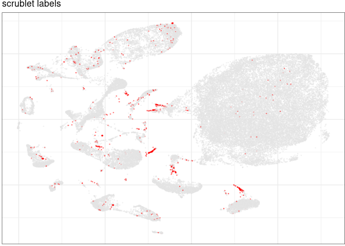<!-- -->

And we can plot the scores for the doublet estimations.

``` r
crm$plotUmap(doublet.method = "scrublet", 
             doublet.scores = TRUE)
```

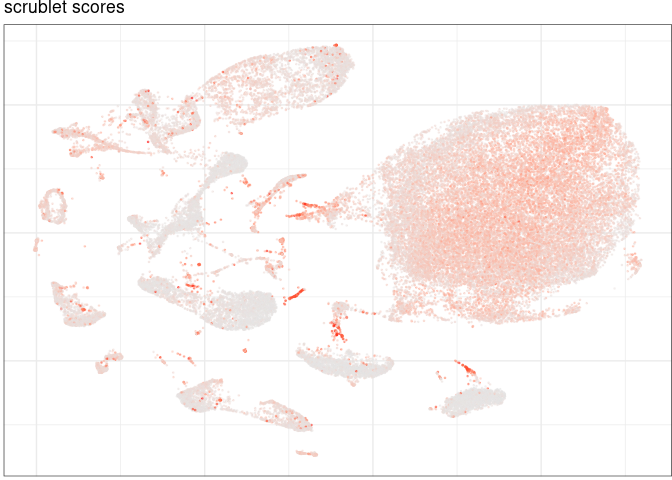<!-- -->

## Differences between methods

We can compare how much `scrublet` and `DoubletDetection` overlap in
their doublets estimates. First, let us plot a bar plot of the number of
doublets per sample.

``` r
scrub.res <- crm$doublets$scrublet$result %>% 
  select(labels, sample) %>% 
  mutate(method = "scrublet")
dd.res <- crm$doublets$doubletdetection$result %>% 
  select(labels, sample) %>% 
  mutate(labels = as.logical(labels), 
         method = "DoubletDetection")

dd.res[is.na(dd.res)] <- FALSE

plot.df <- rbind(scrub.res,
                 dd.res) %>% 
  filter(labels) %>% 
  group_by(sample, method) %>% 
  summarise(count = n())
```

    ## `summarise()` has grouped output by 'sample'. You can override using the
    ## `.groups` argument.

``` r
ggplot(plot.df, aes(sample, count, fill = method)) +
  geom_bar(stat = "identity", position = position_dodge()) +
  crm$theme +
  theme(axis.text.x = element_text(angle = 90, vjust = 0.5)) +
  labs(x = "", y = "No. doublets", fill = "Method", title = "Doublets per sample")
```

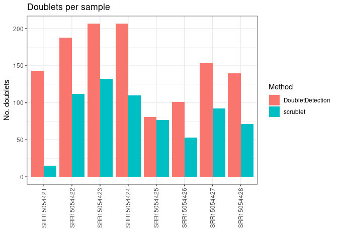<!-- -->

We can also show the total number of doublets detected per method.

``` r
plot.df %>% 
  group_by(method) %>% 
  summarise(count = sum(count)) %>% 
  ggplot(aes(method, count, fill = method)) + 
  geom_bar(stat = "identity") +
  crm$theme +
  guides(fill = "none") +
  labs(x = "", y = "No. doublets", title = "Total doublets per method")
```

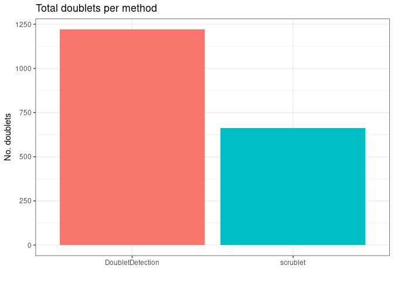<!-- -->

### UMAP

``` r
plot.vec <- data.frame(scrublet = scrub.res$labels %>% as.numeric(), 
                       doubletdetection = dd.res$labels %>% as.numeric()) %>% 
  apply(1, \(x) if (x[1] == 0 & x[2] == 0) "Kept" else if (x[1] == 1 & x[2] == 0) "scrublet" else if (x[1] == 0 & x[2] == 1) "DoubletDetection" else "Both") %>% 
  setNames(rownames(scrub.res)) %>% 
  factor(levels = c("Kept","scrublet","DoubletDetection","Both"))

crm$con$plotGraph(groups = plot.vec, 
                  mark.groups = FALSE, 
                  show.legend = TRUE, 
                  shuffle.colors = TRUE, 
                  title = "Doublets", 
                  size = 0.3) +
  scale_color_manual(values = c("grey80","red","blue","black"))
```

    ## Scale for 'colour' is already present. Adding another scale for 'colour',
    ## which will replace the existing scale.

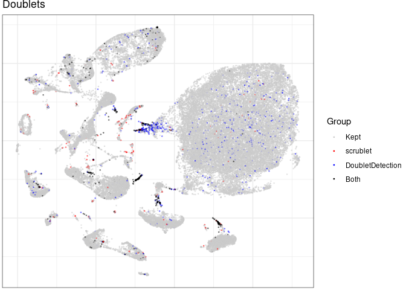<!-- -->

# Mitochondrial fraction

We can also investigate the mitochondrial fraction in our cells

``` r
crm$plotUmap(mito.frac = TRUE, 
             mito.cutoff = 0.05, 
             species = "human")
```

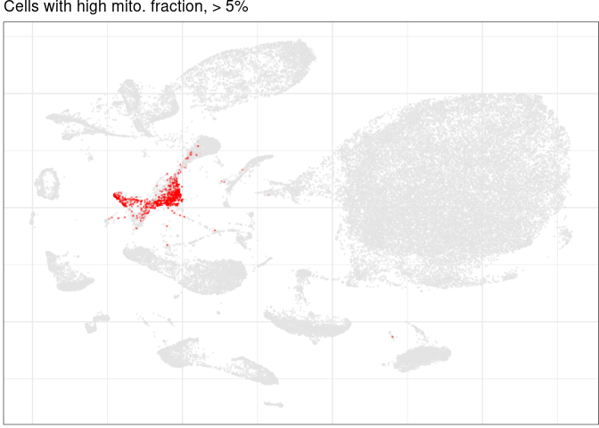<!-- -->

# Plot filtered cells

We can plot all the cells to be filtered in the UMAP embedding

``` r
crm$plotFilteredCells(type = "umap", 
                      depth = TRUE, 
                      depth.cutoff = depth_cutoff_vec, 
                      doublet.method = "scrublet", 
                      mito.frac = TRUE, 
                      mito.cutoff = 0.05, 
                      species = "human")
```

    ## Scale for 'colour' is already present. Adding another scale for 'colour',
    ## which will replace the existing scale.

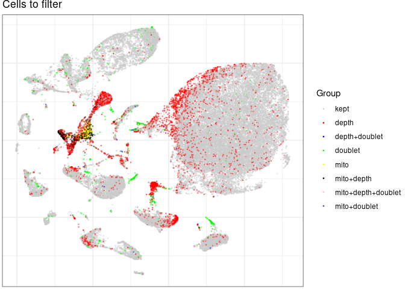<!-- -->

And we can plot the cells to be filtered per sample where `combination`
means a cell that has at least two filter labels, e.g. `mito` and
`depth`.

``` r
crm$plotFilteredCells(type = "bar", 
                      doublet.method = "scrublet", 
                      depth = TRUE, 
                      depth.cutoff = depth_cutoff_vec, 
                      mito.frac = TRUE, 
                      mito.cutoff = 0.05, 
                      species = "human")
```

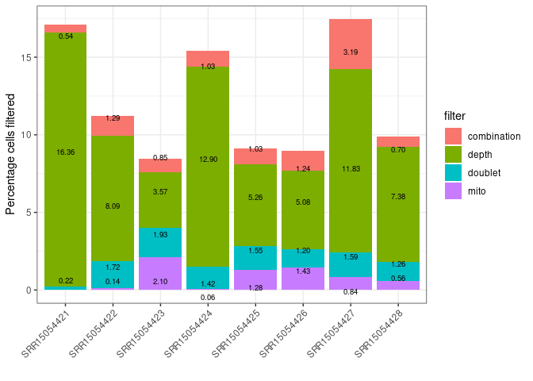<!-- -->

We can also extract the raw numbers for plotting in other ways than
those included here

``` r
filter.data <- crm$plotFilteredCells(type = "export")
filter.data %>% head()
```

    ## # A tibble: 6 × 4
    ##   sample      cell                            variable value
    ##   <chr>       <chr>                           <chr>    <dbl>
    ## 1 SRR15054421 SRR15054421!!AAACCCAAGCCACCGT-1 mito         0
    ## 2 SRR15054421 SRR15054421!!AAACCCAAGCCACCGT-1 depth        0
    ## 3 SRR15054421 SRR15054421!!AAACCCACAGTGACCC-1 mito         0
    ## 4 SRR15054421 SRR15054421!!AAACCCACAGTGACCC-1 depth        0
    ## 5 SRR15054421 SRR15054421!!AAACCCATCACAGTGT-1 mito         0
    ## 6 SRR15054421 SRR15054421!!AAACCCATCACAGTGT-1 depth        0

# Save filtered CMs

Finally, we can filter the count matrices and save them for downstream
applications. Here, we use the `qs` package for saving large files fast.

``` r
crm$filterCms(file = "/data/ExtData/CRMetrics_testdata/cms_filtered",
              method = "qs",
              depth.cutoff = depth_cutoff_vec, 
              mito.cutoff = 0.05, 
              doublets = "doubletdetection",
              samples.to.exclude = NULL,
              species = "human")
```

``` r
sessionInfo()
```

    ## R version 4.1.2 (2021-11-01)
    ## Platform: x86_64-redhat-linux-gnu (64-bit)
    ## Running under: Red Hat Enterprise Linux 8.5 (Ootpa)
    ## 
    ## Matrix products: default
    ## BLAS/LAPACK: /usr/lib64/libopenblas-r0.3.12.so
    ## 
    ## locale:
    ##  [1] LC_CTYPE=en_US.UTF-8    LC_NUMERIC=C            LC_TIME=C              
    ##  [4] LC_COLLATE=en_US.UTF-8  LC_MONETARY=C           LC_MESSAGES=en_US.UTF-8
    ##  [7] LC_PAPER=C              LC_NAME=C               LC_ADDRESS=C           
    ## [10] LC_TELEPHONE=C          LC_MEASUREMENT=C        LC_IDENTIFICATION=C    
    ## 
    ## attached base packages:
    ## [1] stats     graphics  grDevices utils     datasets  methods   base     
    ## 
    ## other attached packages:
    ## [1] dplyr_1.0.10   magrittr_2.0.3 CRMetrics_0.1  ggplot2_3.3.6 
    ## 
    ## loaded via a namespace (and not attached):
    ##   [1] utf8_1.2.2              reticulate_1.26         R.utils_2.12.0         
    ##   [4] tidyselect_1.1.2        htmlwidgets_1.5.4       grid_4.1.2             
    ##   [7] Rtsne_0.16              munsell_0.5.0           codetools_0.2-18       
    ##  [10] ica_1.0-3               future_1.28.0           miniUI_0.1.1.1         
    ##  [13] withr_2.5.0             spatstat.random_2.2-0   colorspace_2.0-3       
    ##  [16] progressr_0.11.0        highr_0.9               knitr_1.40             
    ##  [19] stats4_4.1.2            Seurat_4.1.1            ROCR_1.0-11            
    ##  [22] ggsignif_0.6.3          tensor_1.5              listenv_0.8.0          
    ##  [25] MatrixGenerics_1.6.0    labeling_0.4.2          urltools_1.7.3         
    ##  [28] polyclip_1.10-0         bit64_4.0.5             farver_2.1.1           
    ##  [31] rhdf5_2.38.1            rprojroot_2.0.3         parallelly_1.32.1      
    ##  [34] Matrix.utils_0.9.8      vctrs_0.4.1             generics_0.1.3         
    ##  [37] xfun_0.32               ggpmisc_0.5.0           doParallel_1.0.17      
    ##  [40] R6_2.5.1                clue_0.3-61             ggbeeswarm_0.6.0       
    ##  [43] rhdf5filters_1.6.0      spatstat.utils_2.3-1    assertthat_0.2.1       
    ##  [46] promises_1.2.0.1        scales_1.2.1            vroom_1.5.7            
    ##  [49] rgeos_0.5-9             beeswarm_0.4.0          gtable_0.3.1           
    ##  [52] globals_0.16.1          goftest_1.2-3           drat_0.2.3             
    ##  [55] rlang_1.0.4             MatrixModels_0.5-1      GlobalOptions_0.1.2    
    ##  [58] splines_4.1.2           rstatix_0.7.0           confintr_0.1.2         
    ##  [61] lazyeval_0.2.2          spatstat.geom_2.4-0     broom_1.0.1            
    ##  [64] brew_1.0-7              yaml_2.3.5              reshape2_1.4.4         
    ##  [67] abind_1.4-5             backports_1.4.1         httpuv_1.6.6           
    ##  [70] tools_4.1.2             sccore_1.0.2            ellipsis_0.3.2         
    ##  [73] spatstat.core_2.4-4     RColorBrewer_1.1-3      BiocGenerics_0.40.0    
    ##  [76] ggridges_0.5.3          polynom_1.4-1           Rcpp_1.0.9             
    ##  [79] plyr_1.8.7              sparseMatrixStats_1.7.0 purrr_0.3.4            
    ##  [82] ggpubr_0.4.0            dendsort_0.3.4          rpart_4.1.16           
    ##  [85] deldir_1.0-6            GetoptLong_1.0.5        pbapply_1.5-0          
    ##  [88] cowplot_1.1.1           S4Vectors_0.32.4        zoo_1.8-10             
    ##  [91] SeuratObject_4.1.1      grr_0.9.5               ggrepel_0.9.1          
    ##  [94] cluster_2.1.4           here_1.0.1              data.table_1.14.2      
    ##  [97] scattermore_0.8         circlize_0.4.15         SparseM_1.81           
    ## [100] lmtest_0.9-40           triebeard_0.3.0         RANN_2.6.1             
    ## [103] fitdistrplus_1.1-8      matrixStats_0.62.0      hms_1.1.2              
    ## [106] patchwork_1.1.2         mime_0.12               evaluate_0.16          
    ## [109] xtable_1.8-4            RMTstat_0.3.1           N2R_1.0.1              
    ## [112] shape_1.4.6             IRanges_2.28.0          gridExtra_2.3          
    ## [115] compiler_4.1.2          tibble_3.1.8            KernSmooth_2.23-20     
    ## [118] crayon_1.5.1            R.oo_1.25.0             htmltools_0.5.3        
    ## [121] mgcv_1.8-40             later_1.3.0             tzdb_0.3.0             
    ## [124] conos_1.4.7             tidyr_1.2.1             SoupX_1.6.1            
    ## [127] DBI_1.1.3               ComplexHeatmap_2.13.1   pagoda2_1.0.10         
    ## [130] MASS_7.3-58.1           boot_1.3-28             Matrix_1.5-0           
    ## [133] car_3.1-0               readr_2.1.2             cli_3.4.0              
    ## [136] R.methodsS3_1.8.2       parallel_4.1.2          igraph_1.3.4           
    ## [139] pkgconfig_2.0.3         sp_1.5-0                plotly_4.10.0          
    ## [142] spatstat.sparse_2.1-1   foreach_1.5.2           vipor_0.4.5            
    ## [145] leidenAlg_1.0.3         ggpp_0.4.4              stringr_1.4.1          
    ## [148] digest_0.6.29           sctransform_0.3.4       RcppAnnoy_0.0.19       
    ## [151] spatstat.data_2.2-0     rmarkdown_2.16          leiden_0.4.3           
    ## [154] Rook_1.1-1              uwot_0.1.14             shiny_1.7.2            
    ## [157] quantreg_5.94           rjson_0.2.21            lifecycle_1.0.1        
    ## [160] nlme_3.1-159            jsonlite_1.8.0          Rhdf5lib_1.16.0        
    ## [163] carData_3.0-5           viridisLite_0.4.1       fansi_1.0.3            
    ## [166] pillar_1.8.1            lattice_0.20-45         fastmap_1.1.0          
    ## [169] httr_1.4.4              survival_3.4-0          glue_1.6.2             
    ## [172] iterators_1.0.14        png_0.1-7               bit_4.0.4              
    ## [175] stringi_1.7.8           irlba_2.3.5             future.apply_1.9.1
