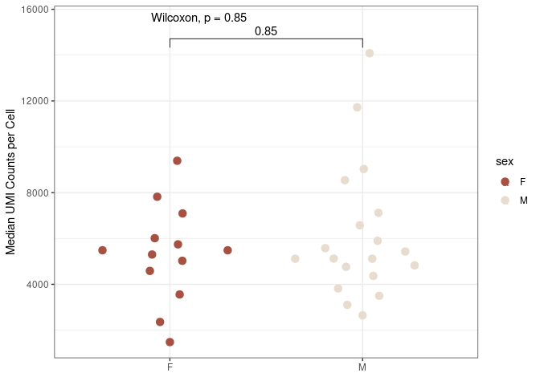
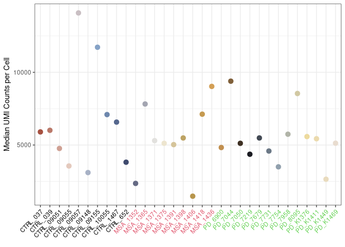
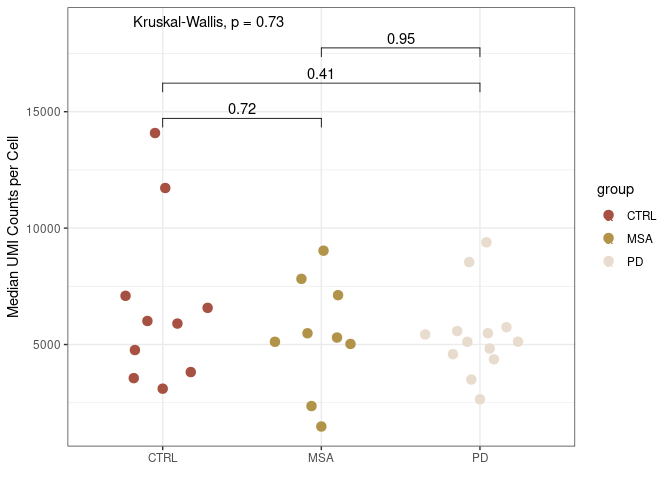
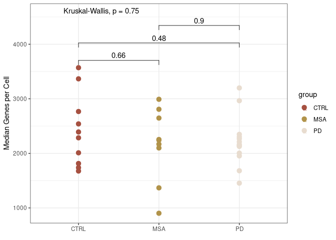
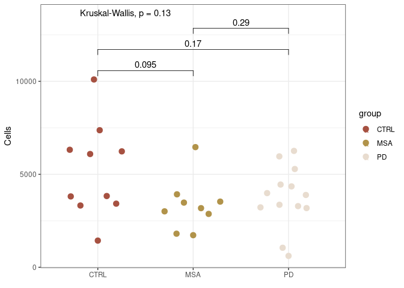
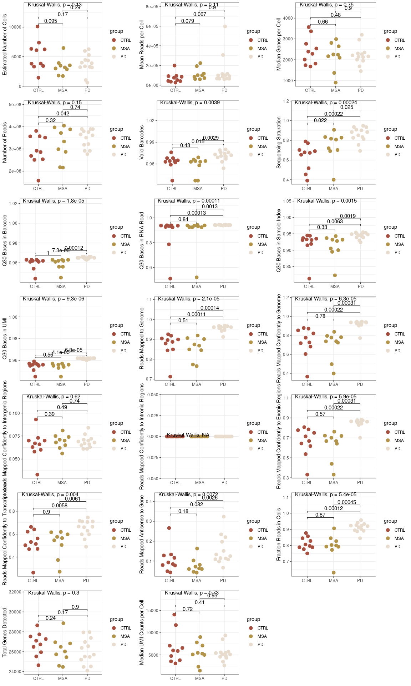
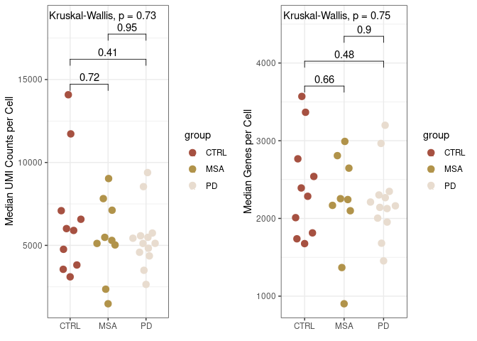
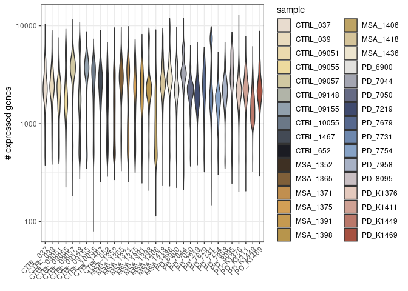
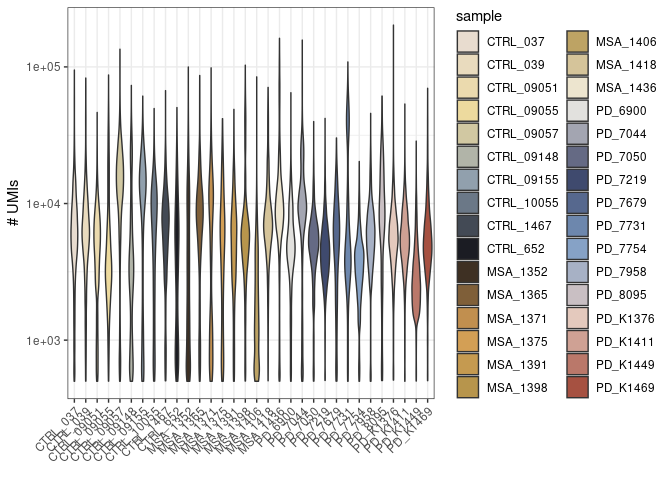

Analysis of PD/MSA data
================

# CRMetrics class

## Initializing a CRMetrics class

Load libraryies

``` r
library(CRMetrics)
```

    ## Loading required package: ggplot2

``` r
library(magrittr) # Why do I need to load magrittr?
```

Initialize a new object of class `CRMetrics` with the path to the Cell
Ranger output and a metadata file. The metadata file contains a column
`sample` with the samples and optionally more columns with factors.

``` r
crm <- CRMetrics$new(data_path = "/data/PD-MSA_lentiform_nucleus/counts_premrna/", 
                           metadata_file = "/people/szr214/CRMetrics/data/metadata.csv", n.cores = 10)
```

    ## 'metadata' doesn't contain the following sample(s) derived from 'data_path' (dropped): PD_7787_FAIL

If some of the functionality has been updated, you must update the
object for the changes to take effect.

``` r
crm %<>% CRMetrics$new()
```

We populated the metadata and the summary metrics field of the object
when initializing it.

``` r
head(crm$metadata)
```

    ##       sample group sex
    ## 1   CTRL_037  CTRL   M
    ## 2   CTRL_039  CTRL   F
    ## 3 CTRL_09051  CTRL   M
    ## 4 CTRL_09055  CTRL   F
    ## 5 CTRL_09057  CTRL   M
    ## 6 CTRL_09148  CTRL   M

``` r
head(crm$summary_metrics)
```

    ## # A tibble: 6 × 3
    ##   sample   metric                            value
    ##   <chr>    <chr>                             <dbl>
    ## 1 CTRL_037 Estimated Number of Cells      7370    
    ## 2 CTRL_037 Mean Reads per Cell           51730    
    ## 3 CTRL_037 Median Genes per Cell          2285    
    ## 4 CTRL_037 Number of Reads           381254619    
    ## 5 CTRL_037 Valid Barcodes                    0.968
    ## 6 CTRL_037 Sequencing Saturation             0.673

## Plotting

From the metadata file we can plot the number of samples per group where
we can also compare the sex distribution.

``` r
# crm$plotSamples(comp_group = "sex")
```

Now we can already create plots from the summary statistics. E.g.,
`Median UMI Counts per Cell` is defined in the Cell Ranger summary
statistics of each sample.

The comparison group is a column in the metadata file. It will be the
variable on the x-axis and pairwise statistical comparisons will be made
on these groups.

``` r
crm$plotMedianUmi(comp_group = "sex")
```

<!-- -->

``` r
crm$plotMedianUmi(comp_group = "group")
```

<!-- -->

If no comparison group is specified, the samples are plotted on the
x-axis.  
This is potentially not very meaningful but it ensures that the plots
work even if we don’t have groups in the samples.

``` r
crm$plotMedianUmi()
```

    ## Using 'sample' for 'comp_group'

    ## Warning: Vectorized input to `element_text()` is not officially supported.
    ## Results may be unexpected or may change in future versions of ggplot2.

<!-- -->

Specifying comparison that is not a column in the metadata will throw an
error.

``` r
crm$addComparison("test")
```

    ## Error in checkCompMeta(comp_group, metadata): 'comp_group' doesn't match any column name in metadata.

We can add a comparison group globally which will be the default if not
specified in the plotting function

``` r
crm$addComparison("group")
crm$plotMedianUmi()
```

<!-- -->

A possibility to reset the comparison group is to se the field in the
class to `NULL`.

``` r
crm$comp_group <- NULL
```

Instead of median UMIs, median number of genes can be expressed as well.

``` r
crm$plotMedianGene("group")
```

<!-- -->

Another plot that can be made from the summary metrics is number of
cells.

``` r
crm$plotCells("group")
```

<!-- -->

Plot all summary metrics or multiple selected ones.

``` r
crm$plotSummaryStats(comp_group = "group")
```

    ## Warning in wilcox.test.default(c(0.968, 0.976, 0.968, 0.964, 0.937, 0.959, :
    ## cannot compute exact p-value with ties

    ## Warning in wilcox.test.default(c(0.968, 0.976, 0.968, 0.964, 0.937, 0.959, :
    ## cannot compute exact p-value with ties

    ## Warning in wilcox.test.default(c(0.963, 0.964, 0.964, 0.958, 0.963, 0.966, :
    ## cannot compute exact p-value with ties

    ## Warning in wilcox.test.default(c(0.673, 0.654, 0.678, 0.391, 0.517, 0.454, :
    ## cannot compute exact p-value with ties

    ## Warning in wilcox.test.default(c(0.673, 0.654, 0.678, 0.391, 0.517, 0.454, :
    ## cannot compute exact p-value with ties

    ## Warning in wilcox.test.default(c(0.834, 0.702, 0.808, 0.817, 0.827, 0.72, :
    ## cannot compute exact p-value with ties

    ## Warning in wilcox.test.default(c(0.962, 0.961, 0.962, 0.944, 0.963, 0.963, :
    ## cannot compute exact p-value with ties

    ## Warning in wilcox.test.default(c(0.962, 0.961, 0.962, 0.944, 0.963, 0.963, :
    ## cannot compute exact p-value with ties

    ## Warning in wilcox.test.default(c(0.962, 0.963, 0.961, 0.962, 0.956, 0.945, :
    ## cannot compute exact p-value with ties

    ## Warning in wilcox.test.default(c(0.937, 0.786, 0.94, 0.509, 0.927, 0.939, :
    ## cannot compute exact p-value with ties

    ## Warning in wilcox.test.default(c(0.937, 0.786, 0.94, 0.509, 0.927, 0.939, :
    ## cannot compute exact p-value with ties

    ## Warning in wilcox.test.default(c(0.937, 0.939, 0.931, 0.943, 0.925, 0.519, :
    ## cannot compute exact p-value with ties

    ## Warning in wilcox.test.default(c(0.915, 0.919, 0.937, 0.813, 0.931, 0.944, :
    ## cannot compute exact p-value with ties

    ## Warning in wilcox.test.default(c(0.915, 0.919, 0.937, 0.813, 0.931, 0.944, :
    ## cannot compute exact p-value with ties

    ## Warning in wilcox.test.default(c(0.928, 0.895, 0.932, 0.9, 0.932, 0.823, :
    ## cannot compute exact p-value with ties

    ## Warning in wilcox.test.default(c(0.956, 0.959, 0.956, 0.945, 0.957, 0.957, :
    ## cannot compute exact p-value with ties

    ## Warning in wilcox.test.default(c(0.956, 0.959, 0.956, 0.945, 0.957, 0.957, :
    ## cannot compute exact p-value with ties

    ## Warning in wilcox.test.default(c(0.956, 0.957, 0.955, 0.955, 0.954, 0.945, :
    ## cannot compute exact p-value with ties

    ## Warning in wilcox.test.default(c(0.918, 0.887, 0.896, 0.712, 0.844, 0.925, :
    ## cannot compute exact p-value with ties

    ## Warning in wilcox.test.default(c(0.918, 0.887, 0.896, 0.712, 0.844, 0.925, :
    ## cannot compute exact p-value with ties

    ## Warning in wilcox.test.default(c(0.901, 0.868, 0.874, 0.906, 0.849, 0.765, :
    ## cannot compute exact p-value with ties

    ## Warning in wilcox.test.default(c(0.877, 0.852, 0.82, 0.681, 0.725, 0.87, :
    ## cannot compute exact p-value with ties

    ## Warning in wilcox.test.default(c(0.794, 0.736, 0.78, 0.496, 0.723, 0.737, :
    ## cannot compute exact p-value with ties

    ## Warning in wilcox.test.default(c(0.07, 0.067, 0.07, 0.063, 0.058, 0.093, :
    ## cannot compute exact p-value with ties

    ## Warning in wilcox.test.default(c(0.07, 0.067, 0.07, 0.063, 0.058, 0.093, :
    ## cannot compute exact p-value with ties

    ## Warning in wilcox.test.default(c(0.071, 0.068, 0.062, 0.056, 0.081, 0.07, :
    ## cannot compute exact p-value with ties

    ## Warning in wilcox.test.default(c(0, 0, 0, 0, 0, 0, 0, 0, 0, 0), c(0, 0, : cannot
    ## compute exact p-value with ties

    ## Warning: Computation failed in `stat_signif()`:
    ## missing value where TRUE/FALSE needed

    ## Warning in wilcox.test.default(c(0.807, 0.785, 0.75, 0.618, 0.668, 0.777, :
    ## cannot compute exact p-value with ties

    ## Warning in wilcox.test.default(c(0.807, 0.785, 0.75, 0.618, 0.668, 0.777, :
    ## cannot compute exact p-value with ties

    ## Warning in wilcox.test.default(c(0.722, 0.668, 0.719, 0.44, 0.642, 0.668, :
    ## cannot compute exact p-value with ties

    ## Warning in wilcox.test.default(c(0.641, 0.663, 0.621, 0.514, 0.503, 0.471, :
    ## cannot compute exact p-value with ties

    ## Warning in wilcox.test.default(c(0.616, 0.565, 0.598, 0.374, 0.546, 0.576, :
    ## cannot compute exact p-value with ties

    ## Warning in wilcox.test.default(c(0.128, 0.085, 0.093, 0.078, 0.133, 0.266, :
    ## cannot compute exact p-value with ties

    ## Warning in wilcox.test.default(c(0.128, 0.085, 0.093, 0.078, 0.133, 0.266, :
    ## cannot compute exact p-value with ties

    ## Warning in wilcox.test.default(c(0.072, 0.063, 0.081, 0.046, 0.06, 0.06, :
    ## cannot compute exact p-value with ties

    ## Warning in wilcox.test.default(c(0.797, 0.828, 0.806, 0.857, 0.845, 0.751, :
    ## cannot compute exact p-value with ties

    ## Warning in wilcox.test.default(c(0.797, 0.828, 0.806, 0.857, 0.845, 0.751, :
    ## cannot compute exact p-value with ties

    ## Warning in wilcox.test.default(c(0.793, 0.8, 0.803, 0.773, 0.792, 0.906, :
    ## cannot compute exact p-value with ties

<!-- -->

``` r
metrics = c("Median UMI Counts per Cell", "Median Genes per Cell")

crm$plotSummaryStats(comp_group = "group", metrics = metrics)
```

<!-- -->

``` r
crm$plotSummaryStats(comp_group = "group", metrics = "Median UMI Counts per Cell")
```

<!-- -->

We can also create plots on statistics of the count matrices.  
This requires to load the detailed metrics and will some time.

``` r
crm$addDetailedMetrics()
```

    ## Loading required namespace: pagoda2

    ## reading 32 dataset(s)

    ## .
    ## .
    ## .
    ## .
    ## .
    ## .
    ## .
    ## .
    ## .
    ## .
    ## .
    ## .
    ## .
    ## .
    ## .
    ## .
    ## .
    ## .
    ## .
    ## .
    ## .
    ## .
    ## .
    ## .
    ## .
    ## .
    ## .
    ## .
    ## .
    ## .
    ## .
    ## .

    ##  done

    ## Filtering...

    ## done!

We can plot the distribution of number of UMIs and expressed genes in
each sample.

``` r
crm$plotGeneCounts()
```

    ## Using 'sample' for 'comp_group'

<!-- -->

``` r
crm$plotUmiCounts()
```

    ## Using 'sample' for 'comp_group'

<!-- -->

``` r
# crm$plotUMAP(cutoff_depth=1e3)
```
